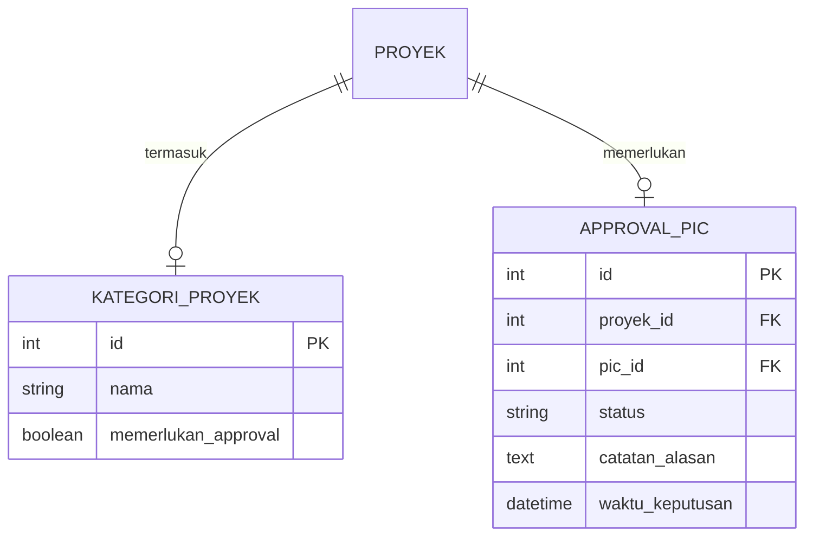
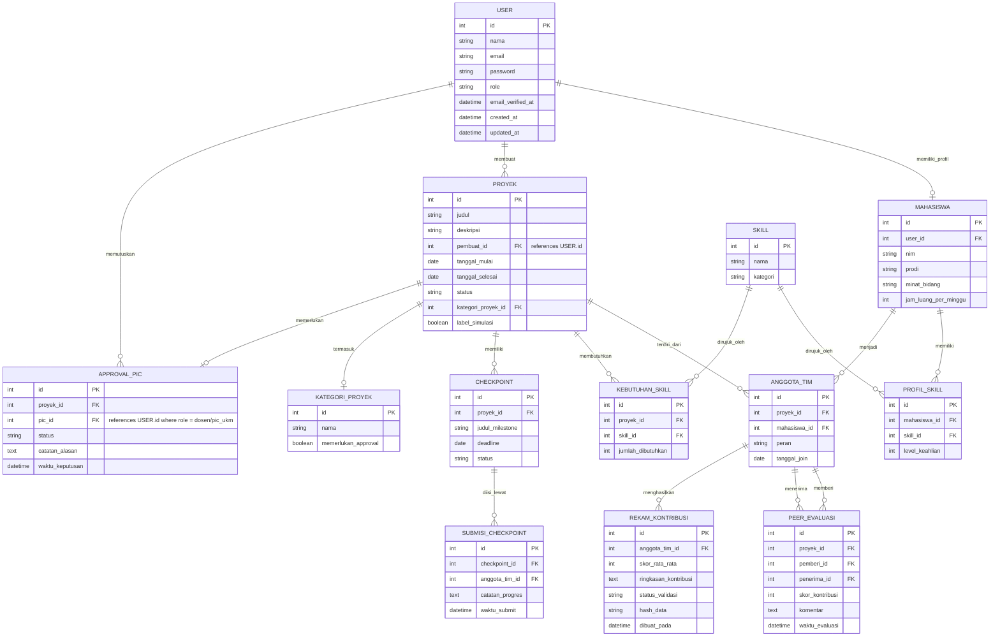

# Platform Kolaborasi Tim Kampus dengan Rekam Jejak Terverifikasi

## Product Requirements Document (PRD) & Rancangan Teknis Lengkap

**Final project UKM Amikom Club Center — dengan potensi pengembangan untuk kompetisi**

| | |
|---|---|
| Versi dokumen | 1.1 (gabungan PRD + rancangan teknis + tech stack) |
| Status | Draft untuk review internal tim |
| Pemilik produk | Amikom Club Center (UKM) |
| Kategori final project | Edutech |

---

# BAGIAN A — PRODUCT REQUIREMENTS DOCUMENT (PRD)

## A.1 Ringkasan Eksekutif

Platform ini menyelesaikan dua masalah yang saling terkait di lingkungan kampus: (1) *free-riding* dalam kerja kelompok yang merusak keadilan penilaian dan kepercayaan antar mahasiswa, dan (2) sulitnya memverifikasi portofolio/rekam jejak mahasiswa karena prosesnya manual dan rawan klaim sepihak. Solusinya adalah satu siklus end-to-end: mahasiswa dicocokkan ke dalam tim berdasarkan skill, bekerja dengan kontribusi yang terlacak sistem, dinilai lewat peer evaluation terstruktur, dan menghasilkan portofolio yang lahir sudah terverifikasi karena datanya berasal dari proses yang sistem saksikan sendiri.

Pengembangan lanjutan menambahkan jembatan ke proyek nyata dari UMKM/organisasi komunitas sekitar kampus, menyelaraskan platform dengan isu pekerjaan layak (SDG 8) di samping isu pendidikan dan keadilan yang sudah dijawab oleh modul inti.

## A.2 Latar Belakang & Justifikasi Masalah (Ringkas)

Penelitian tentang kesulitan mahasiswa membagi tugas kelompok (Jurnal Ilmiah Mahasiswa, Vol. 15 No. 1, Januari 2024) menunjukkan fenomena *free-riding*/*social loafing* sebagai bentuk nyata ketidakseimbangan kontribusi yang mencederai integritas akademik, dengan efek berantai: anggota yang merasa rekannya berkontribusi rendah cenderung ikut menurunkan kontribusinya sendiri.

Laporan HireRight 2025 Global Benchmark Report (1.000+ profesional HR global, Feb–Mar 2025) mencatat bahwa lebih dari tiga perempat bisnis menemukan ketidaksesuaian kandidat selama proses screening dalam 12 bulan terakhir. Survei CareerBuilder dari berbagai tahun secara konsisten menunjukkan skillset dan tanggung jawab kerja sebagai dua kategori yang paling sering dilebih-lebihkan kandidat (kisaran 50–75% tergantung tahun survei).

Data BPS (dikutip The Jakarta Post, Mei 2026) mencatat porsi pekerja formal Indonesia hanya 40,58% dari total angkatan kerja per Februari 2026 — pekerjaan informal tetap dominan. Survei Fiverr (Februari 2024, dikutip CNBC) menemukan 70% Gen Z global sedang freelancing atau berencana freelancing. Kombinasi tren ini berarti mahasiswa perlu membangun rekam jejak profesional kredibel lebih awal, lewat jalur non-tradisional.

*(Latar belakang lengkap dengan seluruh data, rincian sumber, dan catatan kehati-hatian terhadap angka yang bervariasi antar survei tersedia di Bagian B.1.)*

## A.3 Tujuan Produk

| # | Tujuan | Indikator keberhasilan (MVP) |
|---|---|---|
| G1 | Mengurangi free-riding lewat transparansi kontribusi | Setiap anggota tim punya rekam kontribusi individual yang bisa dibandingkan |
| G2 | Menghasilkan portofolio yang kredibel tanpa proses verifikasi manual terpisah | Rekam kontribusi otomatis tergenerate dari data sistem, bukan input manual akhir |
| G3 | Memberi kesempatan kolaborasi lintas prodi yang lebih merata | Matchmaking mempertimbangkan skill match, bukan hanya jejaring sosial yang sudah ada |
| G4 (fase lanjutan) | Menjembatani proyek kampus dengan kebutuhan nyata UMKM/komunitas sekitar | Minimal 1 alur simulasi proyek UMKM berhasil didemoin end-to-end |

## A.4 Posisi Produk

> **Platform kolaborasi proyek kampus dengan rekam jejak yang otomatis terverifikasi.**

Bukan dua aplikasi terpisah (matchmaking + verifier), tetapi satu siklus end-to-end: cari tim → kerja proyek dengan akuntabilitas terukur → portofolio yang lahir sudah tervalidasi karena datanya berasal dari proses yang tercatat sistem, bukan klaim manual belakangan.

| Komponen | Peran | Status pengerjaan |
|---|---|---|
| Matchmaking tim & peer evaluation | **Fitur utama** | MVP — dikerjakan sekarang |
| Verifikasi portofolio (hashing) | **Fitur pendukung** | Fase 2 / roadmap lanjutan |
| Jembatan proyek UMKM | **Fitur dampak sosial** | MVP (simulasi) → Fase 3 (UMKM asli) |

### Diferensiasi vs Aplikasi Sejenis

| Aplikasi | Yang dimiliki | Yang tidak dimiliki |
|---|---|---|
| Trello / Asana | Task management | Tidak ada matchmaking, tidak ada verifikasi |
| LinkedIn | Portofolio publik | Tidak ada bukti proses kerja, rawan klaim sepihak |
| **Platform ini** | Matchmaking berbasis skill + peer evaluation + portofolio yang lahir dari proses tercatat | — |

Pembeda utama: portofolio bukan formulir yang diisi manual lalu "diverifikasi" belakangan, melainkan **hasil sampingan otomatis** dari proses kolaborasi yang sistem sendiri saksikan.

## A.5 Tech Stack

Tech stack mengikuti ketentuan wajib final project: backend PHP/Laravel dengan MySQL, frontend Tailwind CSS, dan komunikasi frontend-backend lewat API.

### A.5.1 Backend

| Komponen | Pilihan | Catatan |
|---|---|---|
| Bahasa & framework | PHP, Laravel (versi LTS terbaru yang tersedia saat development dimulai) | Sesuai ketentuan wajib |
| Database | MySQL (relational) | Sesuai ketentuan wajib; cocok untuk skema relasional yang sudah dirancang di Bagian B.6 (FK antar tabel MAHASISWA, PROYEK, ANGGOTA_TIM, dst) |
| API | Laravel API Resource / RESTful API bawaan Laravel | Direkomendasikan ketentuan; dipakai sebagai penghubung ke frontend, juga membuka peluang integrasi API eksternal di fase lanjutan (GitHub, Google Docs — lihat B.3) |
| Autentikasi | Laravel Sanctum | Cocok untuk autentikasi berbasis token pada SPA/API, ringan untuk skala final project dibanding Passport |
| Queue/job (opsional) | Laravel Queue (database driver, tanpa Redis dulu) | Berguna untuk proses non-blocking seperti generate rekam kontribusi otomatis setelah peer evaluation selesai; database driver cukup untuk skala MVP tanpa infrastruktur tambahan |

### A.5.2 Frontend

**Arsitektur:** frontend dan backend dipisah sepenuhnya — React berjalan sebagai SPA independen yang berkomunikasi dengan Laravel backend lewat RESTful API. Tidak menggunakan Blade/server-side rendering.

| Komponen | Pilihan | Catatan |
|---|---|---|
| CSS framework | Tailwind CSS | Sesuai ketentuan wajib |
| JS framework | React | SPA penuh yang terpisah dari backend Laravel; semua interaksi (form peer evaluation, dashboard matchmaking, skill tag) ditangani React |
| Build tool | Vite | Digunakan sebagai bundler React (via `create-vite`), berjalan di dev server sendiri terpisah dari Laravel |
| HTTP client | Axios | Untuk komunikasi dengan Laravel API; mendukung interceptor untuk token Sanctum |

### A.5.3 Pemetaan tech stack ke fitur

| Fitur (lihat A.9) | Kebutuhan teknis utama |
|---|---|
| Profil mahasiswa, tag skill | Form dinamis (React) + endpoint API CRUD Laravel |
| Mesin matchmaking | Logika skor kecocokan di backend (Laravel service class), dipanggil lewat API saat pencarian proyek |
| Checkpoint & submisi | Tabel relasional MySQL (CHECKPOINT, SUBMISI_CHECKPOINT — lihat B.6), endpoint API dengan validasi tenggat |
| Peer evaluation + variance check | Job/service Laravel untuk hitung variance setelah submisi lengkap; trigger flag otomatis ke status `menunggu_acc_dosen` |
| Rekam kontribusi otomatis | Event listener Laravel (mis. saat peer evaluation terakhir tim masuk) yang menggabungkan data checkpoint + peer score menjadi satu rekam |
| Approval proyek UMKM (PIC) | Role-based middleware Laravel (dosen/PIC vs mahasiswa) untuk membatasi akses endpoint approval |
| Hash chain (fase 2) | Bisa diimplementasikan native di Laravel dengan helper `hash()` PHP bawaan — tidak perlu library eksternal atau node terpisah, tetap dalam batas stack yang diwajibkan |

**Catatan penting:** opsi verifikasi Fase 2 yang sebelumnya dibahas di Bagian B.5 (hash chain mandiri) **kompatibel penuh** dengan stack PHP/Laravel/MySQL yang diwajibkan — tidak perlu bahasa atau database tambahan. Opsi blockchain/Web3 sungguhan (Opsi B di B.5) akan butuh stack tambahan di luar ketentuan (mis. Solidity, node Ethereum/Polygon), sehingga makin menguatkan alasan kenapa opsi itu tetap diposisikan sebagai visi jangka panjang, bukan rencana implementasi dalam final project ini.

## A.6 Lingkup Produk (Scope)

### Dalam lingkup MVP (final project sekarang)

- Modul profil mahasiswa (skill, minat, ketersediaan waktu)
- Modul pembuatan & pencarian proyek (internal UKM/matkul)
- Mesin matchmaking berbasis kecocokan skill
- Modul checkpoint proyek
- Modul peer evaluation dengan variance check
- Modul rekam kontribusi individual (otomatis)
- Modul proyek UMKM simulasi (data dummy)

### Di luar lingkup MVP (roadmap fase lanjutan)

- Verifikasi portofolio berbasis hash chain/blockchain (Bagian B.5)
- Integrasi UMKM asli (bukan simulasi)
- Sinyal kontribusi otomatis dari API eksternal (GitHub, Google Docs)
- Notifikasi/reminder otomatis untuk checkpoint

## A.7 Persona Pengguna

| Persona | Kebutuhan utama | Pain point yang diselesaikan |
|---|---|---|
| Mahasiswa pencari tim | Menemukan rekan tim yang relevan skill-nya untuk proyek/lomba | Sulit mencari tim lintas prodi, sering bergantung pada jejaring pribadi |
| Mahasiswa anggota tim | Kontribusinya diakui secara adil | Risiko ditumpangi anggota free-rider tanpa konsekuensi |
| Dosen/PIC UKM | Memantau dan memvalidasi proyek serta kontribusi tim | Sulit menilai kontribusi individu dalam tugas kelompok secara objektif |
| (Fase lanjutan) UMKM/komunitas mitra | Mendapat bantuan proyek kecil dari mahasiswa terverifikasi | Sulit menemukan talenta mahasiswa yang sudah punya rekam jejak terpercaya |

## A.8 Alur Pengguna Utama (User Flow)

```
1. Mahasiswa membuat profil
   → Input skill, minat, ketersediaan waktu
        ↓
2. Mahasiswa mencari proyek ATAU dosen/PIC membuat proyek baru
   → Termasuk proyek UMKM simulasi yang sudah di-approve PIC
        ↓
3. Sistem menjalankan matchmaking
   → Mencocokkan skill mahasiswa dengan kebutuhan proyek
        ↓
4. Tim terbentuk, proyek berjalan dengan checkpoint berkala
        ↓
5. Di setiap checkpoint / akhir proyek, anggota tim mengisi peer evaluation
   → Sistem menjalankan variance check otomatis
        ↓
6. Sistem menghasilkan rekam kontribusi individual
   → Status: draft → menunggu acc dosen/PIC → final
        ↓
7. Rekam kontribusi final menjadi bagian portofolio mahasiswa
```

## A.9 Spesifikasi Fitur

### A.9.1 Profil Mahasiswa

**Deskripsi:** Mahasiswa mengisi data skill (tag-based, bisa lebih dari satu), minat bidang, dan ketersediaan waktu per minggu.

**Kriteria penerimaan:**
- Mahasiswa dapat menambah/menghapus tag skill
- Mahasiswa dapat mengatur jam ketersediaan per minggu (input numerik)
- Profil menyimpan riwayat proyek yang pernah diikuti (read-only, terisi otomatis seiring proyek selesai)

### A.9.2 Pembuatan & Pencarian Proyek

**Deskripsi:** Proyek dapat dibuat oleh mahasiswa (untuk proyek internal/lomba) atau oleh dosen/PIC UKM (untuk proyek matkul atau proyek UMKM simulasi).

**Kriteria penerimaan:**
- Pembuat proyek mendefinisikan: judul, deskripsi, kebutuhan skill, jumlah anggota dibutuhkan, tenggat waktu
- Proyek berkategori UMKM wajib melalui status `menunggu_approval_PIC` sebelum tampil di pencarian publik
- Dosen/PIC dapat menolak atau menyetujui proyek UMKM dengan catatan alasan

### A.9.3 Mesin Matchmaking

**Deskripsi:** Mencocokkan profil mahasiswa dengan kebutuhan proyek berdasarkan kecocokan skill dan ketersediaan waktu. *(Detail algoritma dan formula skor di Bagian B.4.)*

**Kriteria penerimaan:**
- Sistem menampilkan daftar mahasiswa terurut berdasarkan skor kecocokan skill untuk setiap proyek
- Mahasiswa yang belum pernah mengikuti proyek sebelumnya mendapat penanda "prioritas onboarding" agar lebih mudah terlihat oleh pembuat proyek (mendukung G3 — kesetaraan kesempatan)
- Ketersediaan waktu yang terbatas tidak mengeliminasi mahasiswa dari hasil pencarian, melainkan ditandai agar pembuat proyek bisa menyesuaikan beban tugas

### A.9.4 Checkpoint Proyek

**Deskripsi:** Milestone berkala yang harus diisi progresnya oleh tiap anggota tim.

**Kriteria penerimaan:**
- Pembuat proyek mendefinisikan jumlah dan tenggat checkpoint
- Setiap anggota mengisi catatan progres per checkpoint dengan timestamp tercatat otomatis
- Checkpoint yang lewat tenggat tanpa submisi ditandai sebagai indikator pendukung di rekam kontribusi

### A.9.5 Peer Evaluation

**Deskripsi:** Penilaian kontribusi antar anggota tim di akhir proyek atau di setiap checkpoint.

**Kriteria penerimaan:**
- Setiap anggota menilai semua anggota lain (tidak termasuk dirinya sendiri — divalidasi di level aplikasi)
- Skor kontribusi (skala numerik) dan kolom komentar bebas
- Sistem menjalankan variance check: jika seluruh skor yang diberikan ke satu anggota tim nyaris identik tanpa variasi wajar, sistem menandai untuk ditinjau manual oleh dosen/PIC

Sebagai pelengkap peer score (opsional, bisa fase lanjutan), sistem dapat memanfaatkan sinyal kontribusi terukur otomatis: commit log GitHub, jumlah edit di dokumen kolaboratif (Google Docs API), dan timestamp submission tugas/checkpoint per-anggota — supaya penilaian tidak bergantung sepenuhnya pada self-report yang rawan manipulasi.

### A.9.6 Rekam Kontribusi Individual

**Deskripsi:** Ringkasan otomatis dari checkpoint dan peer evaluation, menjadi dasar portofolio.

**Kriteria penerimaan:**
- Dihasilkan otomatis, bukan diisi manual oleh mahasiswa
- Status berjenjang: `draft` → `menunggu_acc_dosen` → `final`
- Memuat: skor rata-rata peer evaluation, ringkasan kontribusi (deskriptif), riwayat ketepatan waktu checkpoint
- Kolom `hash_data` disiapkan di skema tapi tidak wajib diisi di MVP (untuk fase verifikasi lanjutan)

### A.9.7 Proyek UMKM Simulasi (fitur dampak sosial)

**Deskripsi:** Kategori proyek khusus yang merepresentasikan kebutuhan nyata UMKM/komunitas, namun untuk MVP menggunakan data dummy/simulasi — bukan UMKM asli yang terhubung langsung.

**Kriteria penerimaan:**
- Tersedia minimal 3–5 skenario proyek UMKM simulasi (contoh: pembuatan logo untuk warung kopi fiktif, pengelolaan media sosial untuk toko kerajinan fiktif, audit sederhana untuk koperasi fiktif)
- Setiap proyek UMKM simulasi tetap melalui alur approval dosen/PIC seperti proyek nyata, untuk mendemoin mekanisme governance yang sama dipakai saat nanti terhubung ke UMKM asli
- Portofolio yang dihasilkan dari proyek ini diberi label jelas "simulasi" agar tidak disalahartikan sebagai pengalaman kerja nyata dengan klien sungguhan

**Catatan desain:** fitur ini sengaja dibangun dengan arsitektur yang sama seperti proyek internal (A.9.2), sehingga saat UMKM asli diajak pilot di fase berikutnya, perubahan yang dibutuhkan hanya pada sumber data proyek — bukan membangun ulang alur.

## A.10 Skema Database Tambahan (Pendukung Proyek UMKM)



Tabel `PROYEK` (skema lengkap di Bagian B.6) mendapat tambahan kolom `kategori_proyek_id` dan `label_simulasi` (boolean) untuk mendukung fitur ini.

## A.11 Mitigasi Risiko & Celah

| Risiko | Mitigasi |
|---|---|
| Dua masalah dalam satu produk (matchmaking vs verifikasi) | Posisikan sebagai satu siklus, fitur utama vs pendukung (lihat A.4) |
| Trusted issuer tidak jelas untuk rekam kontribusi | Validasi berjenjang: peer evaluation → opsional acc dosen/PIC sebelum dianggap final |
| Peer evaluation dimanipulasi (saling beri nilai tinggi) | Variance check otomatis + opsi validasi dosen sebelum status final |
| Matchmaking memperkuat ketimpangan (mahasiswa populer terus terpilih) | Penanda prioritas onboarding untuk mahasiswa baru/belum berpengalaman |
| Proyek UMKM simulasi disalahartikan sebagai pengalaman kerja nyata | Label eksplisit "simulasi" pada rekam kontribusi dan portofolio terkait |
| Beban kerja approval menumpuk di dosen/PIC | Batasi jumlah proyek UMKM simulasi yang bisa diajukan per periode di MVP |
| Efek jaringan rendah karena pengguna MVP terbatas | Fokus demo ke skenario 1–2 kelas/UKM, bukan klaim adopsi luas |
| Klaim data riset yang belum solid | Gunakan hanya angka yang sudah terverifikasi (Bagian B.1), lengkapi dengan kuesioner internal kampus (Bagian B.7) |

## A.12 Metrik Keberhasilan (untuk Demo/Evaluasi Final Project)

- Jumlah tim berhasil terbentuk lewat matchmaking dalam skenario demo
- Persentase checkpoint yang terisi tepat waktu
- Jumlah kasus yang ter-flag oleh variance check (menunjukkan fitur berjalan, bukan harus nol)
- Berhasil mendemoin end-to-end satu siklus penuh: profil → matchmaking → proyek UMKM simulasi → peer evaluation → rekam kontribusi final

## A.13 Roadmap Singkat

| Fase | Fokus |
|---|---|
| Fase 1 (MVP — saat ini) | Matchmaking, peer evaluation, rekam kontribusi, proyek UMKM simulasi |
| Fase 2 | Verifikasi portofolio (hash chain mandiri), sinyal kontribusi otomatis dari API eksternal |
| Fase 3 | Pilot dengan UMKM/komunitas asli di sekitar kampus, integrasi data riset agregat untuk dosen/peneliti pendidikan |

---

# BAGIAN B — RANCANGAN TEKNIS & LATAR BELAKANG LENGKAP

*Bagian ini berisi detail pendukung PRD: latar belakang masalah dengan sitasi penuh, ERD lengkap seluruh entitas, rancangan teknis verifikasi portofolio, dan daftar pustaka. Dirujuk dari Bagian A agar PRD tetap ringkas dan fokus pada keputusan produk.*

## B.1 Latar Belakang Masalah (Lengkap dengan Sitasi)

*Bagian ini disusun dari sumber-sumber yang sudah diverifikasi langsung (fetch isi asli, bukan sekadar judul/snippet). Setiap klaim mencantumkan sumber agar bisa ditelusuri ulang untuk keperluan sitasi formal.*

### B.1.1 Konteks Gen Z dan dunia kerja informal (Indonesia)

Berdasarkan data BPS yang dipublikasikan The Jakarta Post (Mei 2026), tingkat pengangguran terbuka Indonesia turun ke 4,68% per Februari 2026 (turun 0,08 poin dari tahun sebelumnya), dengan 7,24 juta orang menganggur. Namun di balik penurunan ini, porsi pekerja formal justru menyusut: jumlah pekerja formal naik dari 59,19 juta menjadi 59,93 juta orang, tetapi *porsinya* terhadap total angkatan kerja justru turun 0,02 poin menjadi 40,58% — melanjutkan tren penurunan tahunan sejak 2024. Artinya, pekerjaan informal tetap mendominasi struktur ketenagakerjaan Indonesia. Seorang peneliti ketenagakerjaan dari Universitas Tidar mengaitkan tren ini dengan meningkatnya jumlah mitra ojek daring, kurir, dan *digital freelancer*.

Dari sisi demografi, data BPS (dikutip GoodStats, Desember 2024) mencatat jumlah pengangguran Indonesia per Agustus 2024 mencapai 7.465.599 orang, dengan Gen Z (usia 15–29 tahun) menyumbang proporsi terbesar yaitu 70% atau 5.188.781 orang. Dari jumlah tersebut, 78,60% berstatus aktif mencari kerja, sementara 17,60% merasa tidak mungkin mendapat pekerjaan (*hopeless*). Secara rinci, pengangguran Gen Z paling banyak berada di rentang usia 20–24 tahun (48,14%), diikuti usia 15–19 tahun (27,60%) dan usia 25–29 tahun (24,26%).

### B.1.2 Konteks global: pergeseran Gen Z ke arah freelance

Survei Fiverr (Februari 2024, 10.033 responden Gen Z di seluruh dunia, dikutip CNBC Make It) menemukan bahwa 70% Gen Z saat ini sedang freelancing atau berencana freelancing di masa depan. Survei Upwork (Mei 2024, 1.070 responden) menambahkan bahwa 53% Gen Z bekerja dengan jam penuh waktu pada proyek freelance, dan Gen Z disebut sebagai generasi yang paling cenderung mengadopsi cara kerja ini. Alasan utama mereka memilih freelance: 44% ingin stabilitas finansial, 30% ingin fleksibilitas untuk bekerja dari mana saja, 25% ingin membangun usaha sendiri, dan 20% ingin pensiun lebih awal.

### B.1.3 Masalah free-rider/social loafing dalam kerja kelompok mahasiswa

Penelitian tentang kesulitan mahasiswa membagi tugas kelompok (Jurnal Ilmiah Mahasiswa, Vol. 15 No. 1, Januari 2024) mengangkat fenomena "numpang nama" atau *free-riding* sebagai bentuk nyata ketidakseimbangan hak dan kewajiban yang mencederai integritas akademik. Studi ini juga mencatat dinamika psikologis menarik: ketika seseorang dalam kelompok merasa anggota lain berkontribusi lebih rendah darinya, ia cenderung mendistorsi persepsi dan ikut menurunkan kontribusinya sendiri — sehingga free-riding bisa menyebar secara berantai dalam satu tim jika tidak dideteksi sejak awal.

Sebagai pelengkap konteks (bukan studi akademik formal, melainkan tulisan opini di platform kumparan), fenomena terkait yang disebut "ghosting" dalam organisasi kemahasiswaan — anggota yang menghilang tanpa pemberitahuan dan memutus komunikasi — dikaitkan dengan rendahnya transparansi organisasi dan kurangnya rasa keterlibatan/kepemilikan anggota terhadap pekerjaan bersama.

**Catatan kehati-hatian:** klaim bahwa free-riding bisa "ditekan secara drastis" melalui matchmaking dan peer evaluation tidak ditemukan secara eksplisit di studi yang dirujuk di atas. Studi tersebut menjelaskan *mekanisme terjadinya* free-riding, bukan mengukur efektivitas intervensi tertentu. Narasi yang aman untuk Bab 1: **literatur menunjukkan free-riding adalah fenomena nyata dan bisa menyebar dalam kelompok karena dinamika persepsi kontribusi**, sehingga intervensi struktural (transparansi kontribusi, evaluasi berkala) secara logis relevan sebagai solusi — bukan klaim bahwa intervensi ini "terbukti menekan secara drastis".

### B.1.4 Masalah validitas portofolio dan rekam jejak (data terverifikasi)

Laporan HireRight 2025 Global Benchmark Report (lebih dari 1.000 profesional HR/talent global, disurvei Feb–Mar 2025) mencatat bahwa **lebih dari tiga perempat bisnis menemukan ketidaksesuaian kandidat (*candidate discrepancies*) selama proses screening dalam 12 bulan terakhir**, dengan riwayat kriminal yang tidak diungkap serta ketidaksesuaian pendidikan/pekerjaan sebagai jenis yang paling umum. Laporan yang sama juga mencatat bahwa **1 dari 6 perusahaan pernah mengalami fraud identitas** dalam proses rekrutmen, dan **7 dari 10 perusahaan global masih belum punya sikap jelas** terhadap kandidat yang menggunakan AI generatif dalam melamar kerja — dan *candidate ghosting* (kandidat yang tiba-tiba tidak responsif) menjadi salah satu tantangan akuisisi talent yang diantisipasi meningkat di 2025.

Untuk data CareerBuilder, **angka bervariasi antar survei dan tahun publikasi** — ini bukan kesalahan kutip, tetapi karena CareerBuilder/Harris Poll menjalankan survei serupa berulang kali di tahun berbeda dengan hasil yang berbeda pula:

| Sumber & tahun survei | Angka utama | Rincian kategori kebohongan tersering |
|---|---|---|
| Survei 2014 (dipublikasikan PRNewswire) | 58% employer pernah menangkap kebohongan di CV | — |
| Dikutip Citation Canada (2017) | "Lebih dari 50%" kandidat mengaku memalsukan/melebih-lebihkan data | Skillset 57%, tanggung jawab 55%, tanggal kerja 42%, jabatan 34%, gelar akademik 33%, mantan pemberi kerja 26%, prestasi/penghargaan 18% |
| Dikutip recruiter.com (analisis gabungan CareerBuilder + HireRight) | — | Tanggal kerja dilebih-lebihkan (~⅓ aplikasi versi HireRight; 10% versi CareerBuilder), tanggung jawab dilebih-lebihkan (38%, kategori tersering versi CareerBuilder), gelar/sertifikat dipalsukan (20% versi HireRight; 10% versi CareerBuilder), mantan pemberi kerja dipalsukan (7%) |
| Dikutip sumber lain (Pierpoint/Omnia) | 75% employer pernah menangkap kebohongan di CV | Skillset 62%, tanggung jawab 54% |

**Implikasi untuk Bab 1:** karena angka rinci CareerBuilder berbeda-beda antar sumber dan tahun, **gunakan rentang/pola umum** ("survei-survei CareerBuilder secara konsisten menunjukkan bahwa skillset dan tanggung jawab kerja adalah dua kategori yang paling sering dilebih-lebihkan kandidat, dengan angka berkisar 50–75% tergantung tahun survei"), bukan satu angka tunggal yang diklaim sebagai angka pasti — kecuali kamu mengutip satu laporan spesifik dengan tahun dan metodologinya secara eksplisit.

**Angka yang sudah dibuang karena tidak terverifikasi:** "84,13 juta pekerja informal per Februari" (tidak cocok dengan data resmi terbaru) dan "80,4% Gen Z mengaku melebih-lebihkan skill" (tidak ditemukan di sumber manapun yang dirujuk).

### B.1.5 Sintesis masalah

Dua masalah ini sebenarnya satu rangkaian: proses kolaborasi yang tidak akuntabel di hulu (free-riding) menghasilkan rekam jejak yang tidak valid di hilir (portofolio yang sulit diverifikasi). Platform ini dirancang untuk menjembatani keduanya dalam satu siklus, bukan sebagai dua tools yang berdiri sendiri.

## B.2 Alur Sistem (End-to-End, Visualisasi Teks)

```
1. Input profil mahasiswa
   → Skill, minat, jam luang
        ↓
2. Mesin matchmaking tim
   → Mencocokkan skill lintas prodi
        ↓
3. Eksekusi proyek tim
   → Checkpoint mingguan
        ↓
4. Peer evaluation
   → Penilaian kontribusi antar anggota
        ↓
5. Rekam kontribusi individual
   → Dihasilkan otomatis dari data sistem (bukan self-report manual)
        ↓
6. Portofolio ter-hash & terverifikasi  [FASE 2]
   → Sumber data sudah tervalidasi sejak awal proses
```

## B.3 Mitigasi Manipulasi Peer Evaluation (Detail Teknis)

Karena peer evaluation sendiri bisa dimanipulasi (misalnya semua anggota saling memberi nilai tinggi / "kongkalikong"), sistem perlu lapisan mitigasi:

- **Variance check**: jika seluruh nilai antar anggota nyaris identik, sistem menandai untuk ditinjau manual (dosen/PIC)
- **Kontribusi terukur otomatis** (opsional, bisa fase lanjutan) — sebagai pelengkap peer score, bukan pengganti, karena peer review saja rawan manipulasi jika dijadikan satu-satunya sumber data:
  - Commit log GitHub (jumlah commit, file yang diubah, per anggota)
  - Jumlah edit di dokumen kolaboratif (Google Docs API — riwayat revisi per kontributor)
  - Timestamp submission tugas/checkpoint per-anggota
  - Jumlah checkpoint yang diisi tepat waktu
- **Validasi berjenjang**: peer evaluation dari tim → opsional di-acc oleh dosen/PIC sebelum dianggap final

## B.4 Rancangan Teknis Mesin Matchmaking (Detail Algoritma)

### B.4.1 Pendekatan: Weighted Scoring

Mesin matchmaking menggunakan *weighted scoring* — dipilih karena lebih transparan, mudah di-debug, dan cukup memadai untuk konteks matchmaking kampus dibanding pendekatan seperti cosine similarity (yang membutuhkan data berbentuk vector/embedding, bukan string skill tag).

**Formula utama:**

```
skor_akhir(mahasiswa, proyek) =
    (skill_score   × 0.80)
  + (minat_bonus   × 0.10)
  + (onboarding_bonus × 0.10)
```

### B.4.2 Komponen skor

#### Komponen 1: `skill_score` — komponen utama (bobot 80%)

Mengukur seberapa banyak skill yang dibutuhkan proyek dimiliki mahasiswa, dan seberapa mahir.

```
skill_score =
  Σ (level_keahlian[k] / LEVEL_MAX)     ← untuk setiap skill k yang cocok
  ─────────────────────────────────────
        |KEBUTUHAN_SKILL proyek|          ← total skill yang dibutuhkan
```

- Pembilang: jumlah `level_keahlian / 5` untuk setiap skill `k` yang cocok antara profil mahasiswa dan kebutuhan proyek
- Penyebut: total skill yang dibutuhkan proyek
- `LEVEL_MAX = 5` (konstanta aplikasi — didefinisikan di config, bukan di database)

**Contoh konkret** — proyek butuh 3 skill: UI/UX, Figma, Copywriting:

| Mahasiswa | Skill yang dimiliki | skill_score |
|---|---|---|
| A | UI/UX (level 4), Figma (level 5), Copywriting (level 3) | (4+5+3) / (5×3) = **0.80** |
| B | UI/UX (level 5), Figma (level 4) saja | (5+4) / (5×3) = **0.60** |
| C | Figma (level 2) saja | 2 / (5×3) = **0.13** |

**Catatan desain:**
- Skill matching menggunakan exact match via FK ke tabel master `SKILL` (lihat B.6) — tidak perlu fuzzy matching karena skill sudah dinormalisasi
- Jika `KEBUTUHAN_SKILL` kosong, `skill_score = 0` untuk semua kandidat — edge case ini ditangani di validasi form pembuatan proyek (kebutuhan skill wajib diisi minimal 1)

#### Komponen 2: `minat_bonus` — sinyal lunak (bobot 10%)

Apakah minat mahasiswa relevan dengan kategori proyek?

```
minat_bonus = 1.0  jika minat_bidang ∩ nama_kategori_proyek tidak kosong
            = 0.0  jika tidak ada irisan
```

Mahasiswa desainer yang minatnya "UI/UX" akan sedikit naik peringkatnya untuk proyek di kategori "Desain Produk" dibanding proyek "Audit Keuangan", meskipun skill tetap faktor dominan.

#### Komponen 3: `onboarding_bonus` — tie-breaker untuk mahasiswa baru (bobot 10%)

Mendukung tujuan G3 (kesetaraan kesempatan):

```
onboarding_bonus = 1.0  jika COUNT(ANGGOTA_TIM WHERE mahasiswa_id = X) = 0
                 = 0.0  jika sudah pernah ikut proyek apapun
```

Tanpa masuk ke skor, dua mahasiswa dengan `skill_score` yang sama akan diurutkan secara arbitrer — dan mahasiswa baru selalu kalah dengan yang sudah berpengalaman karena tidak ada tie-breaker eksplisit. Dengan bobot 10%, mahasiswa baru mendapat dorongan kecil yang terukur tanpa mendistorsi hasil utama. Selain masuk skor, tetap tampilkan badge visual "Anggota Baru" di UI — sesuai narasi A.9.3.

### B.4.3 Perlakuan `jam_luang_per_minggu`

Sesuai A.9.3: ketersediaan waktu tidak mengeliminasi mahasiswa dari hasil pencarian — artinya **tidak masuk formula skor**. Ditampilkan sebagai label informatif di kartu hasil matchmaking:

| Jam luang per minggu | Label UI |
|---|---|
| < 5 jam/minggu | 🔴 Waktu Terbatas |
| 5–15 jam/minggu | 🟡 Ketersediaan Sedang |
| > 15 jam/minggu | 🟢 Tersedia Penuh |

Pembuat proyek bisa menggunakan informasi ini untuk menyesuaikan pembagian tugas, bukan sebagai filter otomatis yang menyembunyikan mahasiswa. Filter opsional di UI ("tampilkan hanya yang >10 jam/minggu") boleh ditambahkan sebagai pilihan pembuat proyek, bukan default sistem.

### B.4.4 Rangkuman formula

```
skor_akhir = (skill_score × 0.80) + (minat_bonus × 0.10) + (onboarding_bonus × 0.10)

skill_score       = Σ (level_keahlian[k] / 5) untuk skill yang cocok
                    ÷ jumlah total KEBUTUHAN_SKILL proyek

minat_bonus       = 1 jika minat_bidang relevan dengan kategori proyek, else 0

onboarding_bonus  = 1 jika mahasiswa belum pernah join proyek apapun, else 0

jam_luang         = label saja, tidak masuk formula
```

## B.5 Rancangan Teknis Verifikasi Portofolio (Fase 2 — Roadmap, Bukan Klaim MVP)

### B.5.1 Perbandingan opsi teknis

| Opsi | Cara kerja | Plus | Minus |
|---|---|---|---|
| **A. Hash sederhana (SHA-256)** | Hash data kontribusi disimpan di kolom database | Mudah diimplementasi, cepat | Tetap dikuasai satu pihak (admin DB) — tamper-evident, bukan tamper-proof murni |
| **B. Blockchain/Web3 sungguhan** | Hash ditulis ke smart contract / soulbound token di chain publik atau privat | Cerita "tamper-proof" benar-benar valid secara teknis, daya tarik kompetisi tinggi | Kompleksitas implementasi tinggi (Solidity, wallet, gas fee), risiko timeline, isu "siapa validator" untuk skala kampus |
| **C. Hash chain mandiri (mirip prinsip blockchain, tanpa jaringan terdesentralisasi)** | Hash dari setiap rekam kontribusi dirangkai berurutan dalam database sendiri — mengubah satu hash merusak rantai setelahnya | Bisa didemoin dengan efek domino yang jelas, realistis untuk timeline UKM | Masih satu server — disebut "hash chain" / "tamper-evident ledger", bukan "blockchain" murni, untuk menjaga akurasi klaim |

### B.5.2 Rekomendasi

- **MVP sekarang**: fokus penuh pada matchmaking + peer evaluation, tanpa fitur verifikasi
- **Fase 2 (jika dilanjutkan)**: implementasikan **Opsi C (hash chain mandiri)** sebagai pembuktian konsep verifikasi yang realistis untuk dikerjakan
- **Dalam dokumen proposal**: tuliskan blockchain/Web3 publik (Opsi B) sebagai **visi pengembangan jangka panjang**, bukan fitur yang sudah diklaim selesai — ini menunjukkan kematangan teknis (paham beda MVP vs visi), bukan overclaim

## B.6 Skema Database Lengkap (ERD)



### B.6.1 Catatan rancangan skema

- Tabel `USER` adalah entitas autentikasi terpusat — semua pengguna (mahasiswa, dosen, PIC UKM, admin) login lewat tabel ini. Kolom `role` menentukan hak akses via middleware Laravel (`mahasiswa`, `dosen`, `pic_ukm`, `admin`)
- `MAHASISWA` adalah **ekstensi profil** dari `USER` — hanya dibuat untuk user dengan `role = mahasiswa`. Relasi `USER → MAHASISWA` adalah one-to-one opsional (dosen/PIC tidak punya baris di `MAHASISWA`)
- `PROYEK.pembuat_id` dan `APPROVAL_PIC.pic_id` keduanya merujuk ke `USER.id` — pembuat proyek bisa mahasiswa atau dosen, sementara PIC selalu user dengan role `dosen` atau `pic_ukm` (divalidasi di level aplikasi)
- `PEER_EVALUASI` memiliki dua relasi ke `ANGGOTA_TIM` (pemberi dan penerima) — wajib dibedakan secara eksplisit di level kode aplikasi untuk mencegah anggota menilai dirinya sendiri (validasi: `pemberi_id != penerima_id`)
- `PEER_EVALUASI.proyek_id` sengaja dipertahankan meskipun bisa diturunkan dari `ANGGOTA_TIM.proyek_id` — ini **denormalisasi disengaja** untuk mempercepat query daftar evaluasi per proyek tanpa join tambahan, dan memudahkan constraint validasi bahwa pemberi dan penerima harus berada di proyek yang sama
- `SUBMISI_CHECKPOINT` tidak memiliki FK langsung ke `MAHASISWA` — data mahasiswa diakses melalui join `SUBMISI_CHECKPOINT → ANGGOTA_TIM → MAHASISWA`. Ini sesuai normalisasi karena submisi selalu dalam konteks keanggotaan tim, bukan mahasiswa secara independen
- `REKAM_KONTRIBUSI.status_validasi` menampung status seperti `draft`, `menunggu_acc_dosen`, `final` — mendukung mekanisme validasi berjenjang
- `REKAM_KONTRIBUSI.hash_data` disiapkan sebagai kolom untuk fase 2 (hash chain), tidak wajib diisi di MVP
- `PROYEK.kategori_proyek_id` dan `PROYEK.label_simulasi` mendukung fitur proyek UMKM simulasi (lihat A.9.7)
- `APPROVAL_PIC` mencatat keputusan dosen/PIC terhadap proyek yang memerlukan approval (mis. kategori UMKM)
- Tabel `SKILL` adalah master data skill yang dinormalisasi — `PROFIL_SKILL` dan `KEBUTUHAN_SKILL` keduanya merujuk ke `SKILL.id` lewat FK, menghindari inkonsistensi akibat perbedaan penulisan (mis. "Python" vs "python")
- `minat_bidang` dan `jam_luang_per_minggu` dipindahkan dari `PROFIL_SKILL` ke `MAHASISWA` karena keduanya adalah atribut per-mahasiswa, bukan per-skill — menyimpannya di `PROFIL_SKILL` akan menyebabkan duplikasi data di setiap baris skill

## B.7 Rencana Pengayaan Data Pendukung (Studi Pendahuluan)

Untuk memperkuat proposal/laporan dengan data lokal, sebarkan kuesioner singkat (Google Form, 30–50 responden mahasiswa kampus sendiri) dengan pertanyaan inti:

1. Apakah pernah kesulitan mencari tim lintas prodi untuk lomba/proyek?
2. Apakah pernah mendapati anggota tim yang menghilang/ghosting tanpa konsekuensi?

Data ini melengkapi data nasional/global (BPS, HireRight) dengan bukti kontekstual yang relevan langsung dengan kampus tempat proyek ini dikembangkan.

## B.8 Ringkasan Struktur Bab 1 (Jika Dilanjutkan ke Proposal Formal)

1. Konteks nasional: pengangguran Gen Z dan dominasi kerja informal di Indonesia (data BPS)
2. Konteks global: tren Gen Z menuju kerja kolaboratif/freelance
3. Masalah akademik: kerja kelompok rentan terhadap free-riding/ghosting
4. Masalah profesional: rekam jejak/portofolio rentan discrepancy dan fraud (data HireRight)
5. Solusi platform: matchmaking tim → peer evaluation → portofolio yang lahir terverifikasi → (opsional) jembatan ke proyek UMKM untuk dampak sosial lebih luas

## B.9 Daftar Pustaka / Sumber Rujukan

Seluruh sumber di bawah ini sudah diverifikasi langsung (isi asli dibaca, bukan hanya judul) per 25 Juni 2026.

1. The Jakarta Post (7 Mei 2026). *"Joblessness falls but more work shifts to informal sector."* https://www.thejakartapost.com/business/2026/05/07/joblessness-falls-but-more-work-shifts-to-informal-sector — Data BPS: tingkat pengangguran 4,68% per Februari 2026; porsi pekerja formal 40,58%.
2. GoodStats Data (10 Desember 2024). *"Lebih dari 800 Ribu Gen Z di RI 'Hopeless' dapat Kerja."* https://data.goodstats.id/statistic/lebih-dari-800-ribu-gen-z-di-ri-hopeless-dapat-kerja-b0LUM — Data BPS Agustus 2024: 70% pengangguran Indonesia adalah Gen Z.
3. CNBC Make It (24 Mei 2024). *"Nearly 70% of Gen Z is actively freelancing or plan to in the future."* https://www.cnbc.com/2024/05/24/nearly-70percent-of-gen-z-is-actively-freelancing-or-plan-to-in-the-future-.html — Survei Fiverr & Upwork tentang tren freelance Gen Z global.
4. Jurnal Ilmiah Mahasiswa, Vol. 15 No. 1, Januari 2024. *"Kesulitan mahasiswa dalam membagi tugas kelompok sebagai efek terhadap perilaku social loafing."* https://al-haramjournal.id/index.php/JIM/article/view/4264 — Studi tentang free-riding/social loafing pada tugas kelompok mahasiswa.
5. Kumparan (23 Juli 2021). *"Fenomena Ghosting pada Organisasi Kemahasiswaan."* https://kumparan.com/richard-goenawan/fenomena-ghosting-pada-organisasi-kemahasiswaan-1wBkitHy89w — Tulisan opini/konten pengguna, bukan jurnal akademik; gunakan sebagai konteks pendukung, bukan rujukan ilmiah utama.
6. HireRight (5 Juni 2025). *"HireRight Releases 2025 Global Benchmark Report."* https://www.hireright.com/company/newsroom/hireright-releases-2025-global-benchmark-report — Lebih dari 75% bisnis menemukan discrepancy kandidat; 1 dari 6 perusahaan mengalami fraud identitas.
7. Recruiter.com. *"4 Hotspots for Lies and False Information on Resumes"* (analisis gabungan CareerBuilder + HireRight). https://recruiter.com/i/4-hotspots-for-lies-and-false-information-on-resumes
8. Citation Canada (19 April 2017). *"Two Truths and a Lie: How to Detect Resume Misrepresentation."* https://www.citationcanada.com/blog/article/two-truths-and-a-lie-how-to-detect-resume-misrepresentation/ — Breakdown kategori kebohongan CV versi survei CareerBuilder yang dikutip ulang.

**Catatan:** sumber nextindonesia.id dan ithy.com yang disebut pada percakapan sebelumnya tidak diverifikasi ulang pada revisi ini karena tidak termasuk dalam daftar URL yang diberikan untuk fetch langsung. Jika ingin dipakai, fetch dan verifikasi isinya terlebih dahulu sebelum dikutip di dokumen formal.