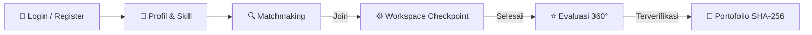
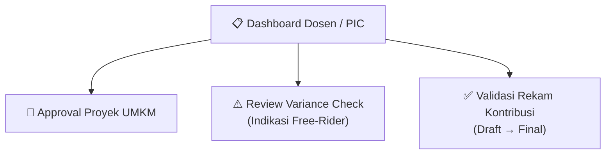

# ROLE_VIEWS.md — Spesifikasi Tampilan & Fitur Berdasarkan Peran Pengguna (*Role-Based Views*)

> Dokumen ini memetakan seluruh antarmuka (halaman dan modal) secara terpisah berdasarkan **peran pengguna (*role*)** sesuai dengan pedoman **[PRD.md](./PRD.md)** (Bab A.7 Persona, A.8 Alur, A.9 Spesifikasi Fitur, dan B.6 Skema Database). Menggunakan pedoman desain **Modern Minimalist × Digital Workspace** dari **[DESIGN.md](./DESIGN.md)**.

---

## 🧭 Ikhtisar Pembagian Hak Akses (*Role-Based Access Control*)

Sistem KolaborasiKampus membagi hak akses ke dalam 4 kelompok pengguna utama yang diatur melalui kolom `USER.role` pada database dan divalidasi oleh *middleware* Laravel Sanctum:

| Role | Kode DB (`USER.role`) | Fokus Utama | Akses Halaman Utama |
|---|---|---|---|
| **Mahasiswa** | `mahasiswa` | Mencari tim, mengerjakan proyek, melaporkan progres, menilai rekan, memperoleh sertifikat | Beranda, Matchmaking, Workspace, Evaluasi, Portofolio, Profil |
| **Dosen / PIC UKM** | `dosen` / `pic_ukm` | Kurasi proyek UMKM, tinjauan *variance check*, validasi akhir rekam kontribusi | Dashboard Dosen, Detail Approval, Review Evaluasi |
| **Mitra UMKM** *(Simulasi/Fase 3)* | `mitra_umkm` / Tamu | Mengajukan kebutuhan digitalisasi usaha (*SDG 8*) | Kemitraan UMKM, Form Pengajuan Mitra |
| **Publik / Tamu / Rekruter** | *(Guest)* | Mengecek keaslian portofolio kriptografis SHA-256 | Beranda, Verifikasi Publik (*Explorer*) |

---

## 1. 🎓 TAMPILAN PERAN: MAHASISWA (`mahasiswa`)

Peran dengan alur interaksi paling lengkap (siklus *end-to-end* dari pencarian tim hingga portofolio terverifikasi). Visual harus terasa seperti *workspace* profesional untuk para *builder* (inspirasi Linear / Vercel / GitHub).

### 1.1 Halaman Autentikasi & Registrasi (`RegisterPage.jsx` & `LoginPage.jsx`)
* **Tujuan**: Pintu masuk mahasiswa menggunakan email kampus dan pembuatan profil dasar.
* **Ketentuan PRD (A.9.1, B.6)**:
  * Wajib mengisi Nama, Email Kampus, Password, NIM, dan Program Studi (`MAHASISWA.prodi`).
  * Relasi `USER` → `MAHASISWA` dibuat secara otomatis saat registrasi dengan `role = 'mahasiswa'`.
* **Desain UI (*Modern Minimalist Workspace*)**: Kartu bersih berlatar *surface* (`bg-[#FAFAFA] border border-[#E5E7EB] rounded-[20px]`), bayangan sangat halus (`shadow-[0_8px_30px_rgba(0,0,0,0.04)]`), tombol utama berwarna Hijau Brand (`#22C55E`) ber-radius halus dengan tipografi *medium weight*.

### 1.2 Halaman Profil & Kurasi Keahlian (`ProfilePage.jsx`)
* **Tujuan**: Mengatur identitas keahlian dan kapasitas waktu mahasiswa sebagai input mesin *matchmaking*.
* **Ketentuan PRD (A.9.1, B.4.2, B.6)**:
  * **Tag Skill**: Mahasiswa dapat menambah/menghapus *skill tag* dari master tabel `SKILL` beserta penentuan tingkat keahlian (Level 1–5). Disimpan di tabel `PROFIL_SKILL`.
  * **Minat Bidang**: Memilih bidang proyek yang disukai (`MAHASISWA.minat_bidang`) untuk memberi *minat_bonus* (bobot 10%) saat kalkulasi *matchmaking*.
  * **Ketersediaan Waktu**: Input numerik jam luang per minggu (`MAHASISWA.jam_luang_per_minggu`).
  * **Penanda Onboarding**: Jika mahasiswa belum pernah bergabung dalam proyek apapun (`COUNT(ANGGOTA_TIM) == 0`), sistem menampilkan *badge* khusus **"Anggota Baru / Prioritas Onboarding"** untuk mendapatkan dorongan bobot 10% (*onboarding_bonus*).
* **Desain UI**: Kartu putih bersih (`bg-white rounded-[20px] border border-[#E5E7EB]`), *skill badge* bergaya *pill* dengan latar abu muda (`#F3F4F6`), indikator kapasitas waktu bergaya *progress bar* yang rapi.

### 1.3 Halaman Matchmaking & Cari Tim (`MatchmakingSection.jsx` & `ProjectDetailPage.jsx`)
* **Tujuan**: Menemukan dan mendaftar ke tim proyek yang relevan secara objektif.
* **Ketentuan PRD (A.9.2, A.9.3, B.4)**:
  * **Mesin Skor Weighted Matchmaking**: Kartu proyek menampilkan persentase kecocokan berdasarkan rumus:
    $$\text{Skor} = (\text{Skill Score} \times 80\%) + (\text{Minat Bonus} \times 10\%) + (\text{Onboarding Bonus} \times 10\%)$$
  * **Label Ketersediaan Waktu (PRD B.4.3)**: Waktu luang **tidak mengeliminasi** hasil pencarian, melainkan diberi label warna informatif:
    * < 5 jam/mgg: 🔴 *Waktu Terbatas*
    * 5–15 jam/mgg: 🟡 *Ketersediaan Sedang*
    * > 15 jam/mgg: 🟢 *Tersedia Penuh*
  * **Pembuatan Proyek Internal**: Mahasiswa dapat membuat proyek lomba/internal baru (Judul, Kebutuhan Skill, Jam/Mgg, Deskripsi). Proyek UMKM tidak dapat dibuat langsung oleh mahasiswa tanpa persetujuan PIC.
* **Desain UI**: Layout grid 12-kolom responsif, kartu proyek `rounded-[20px]` dengan *border* tipis `#E5E7EB`, *badge* kompatibilitas dengan indikator angka dan progres (misal: *94% Match*), serta efek *hover* halus (`translate-y-[-2px]` dan *scale* `1.01`).

### 1.4 Halaman Ruang Kerja & Checkpoint (`WorkspaceSection.jsx`)
* **Tujuan**: Catatan akuntabilitas progres mingguan untuk mencegah perilaku *free-rider* / *social loafing*.
* **Ketentuan PRD (A.9.4, B.3, B.6)**:
  * **Submisi Checkpoint**: Anggota tim melaporkan progres per milestone dengan catatan pengerjaan (`SUBMISI_CHECKPOINT.catatan_progres`) dan bukti tautan (*evidence URL* seperti GitHub PR / Figma). Timestamp tercatat otomatis.
  * **Deteksi Free-Rider Sistem**: Panel samping memantau persentase kontribusi per anggota. Jika kontribusi individu < 10% dari rata-rata tim, sistem memberikan peringatan merah (*flagging*) dan menahan sertifikat final project.
  * **Ambang Batas Kelulusan**: Partisipasi wajib $\ge 75\%$ dari total *checkpoint* untuk berhak mendapatkan kredensial SHA-256.
* **Desain UI**: Tampilan *digital workspace* bersih, daftar milestone dengan latar `bg-[#FAFAFA]` dan *border* `#E5E7EB`, tombol laporkan berwarna Hijau Brand (`#22C55E`), serta panel *anti-free-rider* yang minimalis namun tegas.

### 1.5 Halaman Evaluasi Sejawat 360° (`PeerEvalSection.jsx`)
* **Tujuan**: Penilaian kontribusi silang antar rekan satu tim di akhir proyek atau akhir sprint.
* **Ketentuan PRD (A.9.5, B.3, B.6)**:
  * **Validasi Anti-Self-Review**: Mahasiswa wajib menilai semua rekan tim kecuali dirinya sendiri (divalidasi di tingkat kode: `pemberi_id != penerima_id`).
  * **Dimensi Penilaian**: 4 aspek (Kualitas Deliverables, Ketepatan Waktu, Kerja Sama, Komunikasi) dengan skala 1.0 – 5.0.
  * **Variance Check Otomatis**: Jika nilai rata-rata yang diterima seorang anggota sangat rendah (< 3.2) atau semua nilai antar anggota nyaris identik mencurigakan (*kongkalikong*), sistem memicu **"Variance Check Terpicu!"** dan menahan status evaluasi untuk diperiksa Dosen/PIC.
* **Desain UI**: Kartu penilaian ber-radius 20px dengan *rating* menggunakan angka dan *progress indicator* (bukan sekadar bintang), *alert banner* kuning/oranye halus untuk notifikasi *variance check*.

### 1.6 Halaman Portofolio & Rekam Kontribusi Mandiri (`PortfolioPage.jsx`)
* **Tujuan**: Menampilkan bukti sah rekam jejak kolaborasi mahasiswa yang terverifikasi otomatis oleh sistem.
* **Ketentuan PRD (A.9.6, A.9.7, B.5)**:
  * **Data Otomatis**: Bukan hasil klaim manual sepihak, melainkan agregasi otomatis dari log *checkpoint* dan skor rata-rata *peer evaluation*.
  * **Status Berjenjang**: `draft` $\rightarrow$ `menunggu_acc_dosen` $\rightarrow$ `final`.
  * **Label Simulasi Eksplisit**: Jika proyek berasal dari skenario UMKM simulasi (PRD A.9.7), wajib tercantum label peringatan tegas: **"⚠ SIMULASI — data dummy, bukan proyek UMKM nyata"** agar tidak merancukan rekruter.
  * **Kredigrafis SHA-256**: Menampilkan *hash* kriptografis unik (`REKAM_KONTRIBUSI.hash_data`) yang bersifat *tamper-evident* (anti-pemalsuan).
* **Desain UI**: Kartu sertifikat bergaya *developer credential* profesional, kotak *hash display* bersudut 20px berlatar `#F3F4F6` dengan tipografi monospace, lencana terverifikasi beraksen Hijau (`#22C55E`) atau Indigo (`#4F46E5`).

---

## 2. 👨‍🏫 TAMPILAN PERAN: DOSEN / PIC UKM (`dosen` / `pic_ukm`)

Peran supervisor dan kurator untuk menjaga kualitas proyek, menyetujui kemitraan, serta memvalidasi rekam jejak akhir.

### 2.1 Dashboard Utama Dosen / PIC (`DosenDashboard.jsx`)
* **Tujuan**: Pusat kendali pemantauan aktivitas mahasiswa, kesehatan tim, dan daftar tugas persetujuan (*pending approvals*).
* **Ketentuan PRD (A.9.2, A.10, A.12)**:
  * Menampilkan metrik utama: Total Proyek Dibina, Jumlah Mahasiswa Terlibat, Tingkat Ketepatan Waktu Checkpoint, dan Kasus Ter-flagging.
  * Akses cepat ke 3 antrean utama: (1) Antrean Proyek UMKM, (2) Antrean Evaluasi Mencurigakan, (3) Antrean Validasi Portofolio.
* **Desain UI**: Layout grid modular 12-kolom bergaya *workspace* (inspirasi Linear / Vercel), kartu putih dengan *border* tipis `#E5E7EB`, *badge* antrean warna Indigo (`#4F46E5`).

### 2.2 Halaman Approval Proyek UMKM (`UmkmApprovalView.jsx` / Modal M5)
* **Tujuan**: Kurasi proyek yang diajukan dengan label UMKM sebelum ditayangkan ke pencarian publik mahasiswa.
* **Ketentuan PRD (A.9.2, A.9.7, A.10)**:
  * Proyek berkategori UMKM wajib melalui status `menunggu_approval_PIC`.
  * Dosen/PIC melakukan peninjauan terhadap deskripsi, kelayakan beban kerja, dan relevansi kompetensi.
  * **Aksi Keputusan**: Setujui (*Approve*) atau Tolak (*Reject*) wajib disertai pengisian form **Catatan Alasan** (`APPROVAL_PIC.catatan_alasan`). Waktu keputusan tercatat di `waktu_keputusan`.
* **Desain UI**: Tabel/daftar proyek dengan kartu `rounded-[20px]`, tombol keputusan ganda (Setujui = Hijau `#22C55E`, Tolak = Putih ber-outline merah/abu tipis).

### 2.3 Halaman Review Variance Check & Resolusi Free-Rider (`VarianceReviewView.jsx`)
* **Tujuan**: Menginvestigasi tim yang mengalami konflik nilai atau terdeteksi anomali oleh sistem *peer evaluation*.
* **Ketentuan PRD (A.9.5, B.3)**:
  * Menampilkan daftar tim yang status evaluasinya ter-flagging karena skor < 3.2 atau nilai identik seragam.
  * Dosen dapat melihat komparasi log *checkpoint* mingguan vs skor *peer evaluation* yang diberikan antar rekan.
  * **Aksi Keputusan**: Dosen dapat melakukan *override* (menyetujui nilai apa adanya, membatalkan nilai rekan yang tidak objektif, atau mendiskualifikasi anggota *free-rider* dari sertifikat).
* **Desain UI**: Panel komparasi data dua kolom yang bersih, *banner* peringatan bersudut halus dengan ikon *outline* dan aksen dekorasi pixel kecil.

### 2.4 Halaman Validasi Akhir Rekam Kontribusi (`ContributionValidationView.jsx`)
* **Tujuan**: Pengesahan jenjang akhir agar portofolio mahasiswa resmi berstatus `final` dan diterbitkan *hash* SHA-256.
* **Ketentuan PRD (A.9.6, B.3, B.6)**:
  * Menampilkan daftar rekam kontribusi dengan status `menunggu_acc_dosen`.
  * Dosen memeriksa ringkasan kontribusi otomatis dan memastikan tidak ada keberatan dari anggota tim.
  * Saat tombol **"Sah & Terbitkan Kredensial"** diklik, sistem mengubah `status_validasi = 'final'` dan men-generate string `hash_data` SHA-256.
* **Desain UI**: Daftar periksa (*checklist*) minimalis bergaya *developer-first*, tombol *batch approval* Hijau Brand (`#22C55E`).

---

## 3. 🤝 TAMPILAN PERAN: MITRA UMKM (`mitra_umkm` / Tamu)

Peran untuk menyelaraskan platform dengan dampak sosial nyata (SDG 8: Pekerjaan Layak & Pertumbuhan Ekonomi). Pada MVP saat ini dijalankan sebagai **Simulasi / Data Dummy** (PRD A.9.7), namun antarmuka disiapkan untuk integrasi UMKM asli di Fase 3.

### 3.1 Halaman Portal Kemitraan UMKM (`UmkmSection.jsx`)
* **Tujuan**: Etalase proyek digitalisasi usaha lokal serta publikasi dampak sosial platform.
* **Ketentuan PRD (A.9.7, A.10)**:
  * Menampilkan 3–5 skenario proyek simulasi (misal: Pembuatan Sistem Kasir Warung Kopi, Digitalisasi Stok Batik, dll.).
  * Menampilkan bukti dampak (*Proof Points*): Jumlah UMKM Terdigitalisasi, Mahasiswa Terlibat, Kontribusi Valid.
  * **Label Simulasi Wajib**: Setiap kartu proyek dan deskripsinya harus memuat keterangan jelas bahwa data saat ini adalah simulasi pembelajaran agar tidak terjadi salah paham hukum/komersial.
* **Desain UI**: Kartu berlatar Putih dengan *border* tipis `#E5E7EB`, *badge* **SDG 8 · DECENT WORK** bergaya *pill* dengan warna hijau `#22C55E`.

### 3.2 Modal Pendaftaran Kemitraan UMKM (Modal M3)
* **Tujuan**: Formulir bagi pemilik usaha lokal untuk mengajukan permasalahan bisnis mereka agar dijadikan *project challenge* mahasiswa.
* **Ketentuan PRD (A.9.7)**:
  * Input field: Nama Usaha (`umkmName`), Nama Pemilik (`ownerName`), Kontak WhatsApp (`contact`), Lokasi (`location`), dan Deskripsi Kebutuhan Digitalisasi (`need`).
  * Setelah disubmit, proyek otomatis masuk ke tabel `PROYEK` dengan `kategori_proyek_id = UMKM`, `label_simulasi = true`, dan status `menunggu_approval_PIC`.
* **Desain UI**: Modal *overlay* dengan kartu `rounded-[20px]`, *soft shadow*, form input bergaya *workspace*, dan tombol kirim Hijau Brand (`#22C55E`).

---

## 4. 🌐 TAMPILAN PERAN: PUBLIK / TAMU / REKRUTER (*Guest Explorer*)

Peran tanpa perlu *login* yang ditargetkan bagi rekruter HRD, perusahaan, atau masyarakat umum yang ingin memvalidasi kebenaran klaim CV mahasiswa.

### 4.1 Halaman Beranda Publik (`Hero.jsx` & `Navbar.jsx`)
* **Tujuan**: Memperkenalkan filosofi *Anti-Free-Rider* dan akuntabilitas platform kepada pengunjung baru.
* **Ketentuan PRD (A.1, A.4)**:
  * Menjelaskan diferensiasi utama platform vs Trello/LinkedIn: *"Portofolio bukan formulir yang diisi manual belakangan, melainkan hasil sampingan otomatis dari proses kolaborasi yang sistem saksikan"*.
  * Menyediakan tombol navigasi masuk/daftar dan akses cepat ke fitur pencarian tim publik.
* **Desain UI (*Modern Minimalist × Digital Workspace*)**: Kiri: Headline besar (Space Grotesk / Satoshi), deskripsi singkat, CTA utama Hijau (`#22C55E`), CTA sekunder Putih ber-outline. Kanan: Mockup dashboard digital dengan *floating pixel decorations* (seperti ikon Laptop, Robot, Folder, atau Sparkles kecil).

### 4.2 Halaman Explorer / Verifikasi Portofolio Publik (`VerifyPage.jsx` — Fase 2)
* **Tujuan**: Mesin pencari keaslian sertifikat digital berdasarkan *hash string* SHA-256.
* **Ketentuan PRD (A.4, B.5 — Opsi C Hash Chain Mandiri)**:
  * Rekruter memasukkan kode *hash* SHA-256 yang tertera pada CV/LinkedIn mahasiswa ke dalam kotak pencarian.
  * Jika *hash* ditemukan dan valid, sistem menampilkan kartu sertifikat resmi dengan cap **"TERVERIFIKASI √ — TAMPER-PROOF"**.
  * Menampilkan rincian: Nama Mahasiswa, Judul Final Project, Peran, Skor Rata-Rata Sejawat, Nama Dosen Pembimbing yang mengesahkan, serta Timestamp penerbitan.
  * Jika *hash* tidak cocok atau telah dimodifikasi, sistem menampilkan peringatan merah **"X HASH TIDAK DIKENALI / DATA TELAH DIMODIFIKASI"**.
* **Desain UI**: Halaman verifikasi bergaya *developer workspace* yang bersih, kotak input dengan *border* `#E5E7EB`, kartu hasil verifikasi `rounded-[20px]` dengan indikator terverifikasi Hijau (`#22C55E`) atau Indigo (`#4F46E5`).

---

## 📊 Matriks Ringkasan Relasi Peran, Halaman, & Tabel Database

| Halaman / View | Role Akses | Komponen Frontend | Tabel Utama Terkait (ERD PRD B.6) |
|---|---|---|---|
| **Beranda / Landing** | Semua / Publik | `Hero.jsx` | — (Informatis statis & metrik publik) |
| **Login & Register** | Tamu $\rightarrow$ Semua | `LoginPage.jsx`, `RegisterPage.jsx` | `USER`, `MAHASISWA` |
| **Profil & Skill** | Mahasiswa | `ProfilePage.jsx` | `MAHASISWA`, `PROFIL_SKILL`, `SKILL` |
| **Matchmaking & Cari Tim** | Mahasiswa, Dosen | `MatchmakingSection.jsx` | `PROYEK`, `KEBUTUHAN_SKILL`, `ANGGOTA_TIM` |
| **Detail Proyek** | Mahasiswa, Dosen | `ProjectDetailPage.jsx` | `PROYEK`, `CHECKPOINT`, `ANGGOTA_TIM` |
| **Ruang Kerja Checkpoint** | Mahasiswa (Anggota Tim) | `WorkspaceSection.jsx` | `CHECKPOINT`, `SUBMISI_CHECKPOINT`, `ANGGOTA_TIM` |
| **Evaluasi Sejawat 360°** | Mahasiswa (Anggota Tim) | `PeerEvalSection.jsx` | `PEER_EVALUASI`, `ANGGOTA_TIM` |
| **Portofolio Mandiri** | Mahasiswa | `PortfolioPage.jsx` | `REKAM_KONTRIBUSI`, `MAHASISWA`, `PROYEK` |
| **Dashboard Dosen / PIC** | Dosen / PIC UKM | `DosenDashboard.jsx` | `PROYEK`, `APPROVAL_PIC`, `REKAM_KONTRIBUSI` |
| **Approval Proyek UMKM** | Dosen / PIC UKM | Modal M5 / View Dosen | `APPROVAL_PIC`, `PROYEK`, `KATEGORI_PROYEK` |
| **Review Variance Check** | Dosen / PIC UKM | View Dosen | `PEER_EVALUASI`, `CHECKPOINT`, `ANGGOTA_TIM` |
| **Kemitraan UMKM (Simulasi)**| Semua / Mitra UMKM | `UmkmSection.jsx`, Modal M3 | `PROYEK`, `KATEGORI_PROYEK` |
| **Verifikasi Publik SHA-256**| Publik / Rekruter | `VerifyPage.jsx` *(Fase 2)* | `REKAM_KONTRIBUSI` (`hash_data`) |

---
*Dokumen ini menjadi acuan utama pengembangan antarmuka spesifik per peran (Role-Based Frontend Implementation) pada tahapan sprint berikutnya.*
