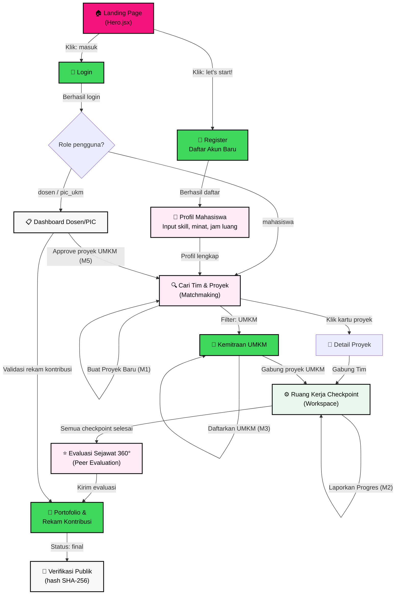

# Daftar Halaman & Alur Navigasi — KolaborasiKampus

> Berdasarkan [PRD.md](file:///d:/laragon/www/bismillah_champions/PRD.md) (A.8, A.9.1–A.9.7, B.2) dan [FRONTEND.md](file:///d:/laragon/www/bismillah_champions/FRONTEND.md).

---

## Ringkasan: Total 12 Halaman + 5 Modal

| # | Halaman | Status Saat Ini | Prioritas |
|---|---------|-----------------|-----------|
| 1 | Landing Page (Beranda) | ✅ Ada (`Hero.jsx`) | MVP |
| 2 | Register (Daftar Akun) | ❌ Belum ada | MVP |
| 3 | Login (Masuk) | ❌ Belum ada | MVP |
| 4 | Profil Mahasiswa | ❌ Belum ada | MVP |
| 5 | Cari Tim & Proyek (Matchmaking) | ✅ Ada (`MatchmakingSection.jsx`) | MVP |
| 6 | Detail Proyek | ❌ Belum ada (inline di card saat ini) | MVP |
| 7 | Ruang Kerja Checkpoint | ✅ Ada (`WorkspaceSection.jsx`) | MVP |
| 8 | Evaluasi Sejawat 360° | ✅ Ada (`PeerEvalSection.jsx`) | MVP |
| 9 | Portofolio & Rekam Kontribusi | ❌ Belum ada (inline di PeerEval saat ini) | MVP |
| 10 | Kemitraan UMKM | ✅ Ada (`UmkmSection.jsx`) | MVP |
| 11 | Dashboard Dosen/PIC | ❌ Belum ada | MVP |
| 12 | Verifikasi Portofolio Publik | ❌ Belum ada | Fase 2 |

### Modal / Overlay (bukan halaman penuh)

| # | Modal | Halaman Induk | Status |
|---|-------|---------------|--------|
| M1 | Buat Proyek Baru | Matchmaking | ✅ Ada |
| M2 | Laporkan Progres Checkpoint | Workspace | ✅ Ada |
| M3 | Daftarkan UMKM | Kemitraan UMKM | ✅ Ada |
| M4 | Edit Profil / Skill | Profil Mahasiswa | ❌ Belum |
| M5 | Approval Proyek UMKM | Dashboard Dosen/PIC | ❌ Belum |

---

## Alur Pengguna Utama (User Flow)

Berdasarkan PRD A.8 dan B.2, siklus end-to-end platform:



---

## Detail Setiap Halaman

### 1. 🏠 Landing Page (Beranda)
- **Komponen**: `Hero.jsx`
- **Modul PRD**: — (overview platform)
- **Status**: ✅ Sudah ada
- **Konten utama**:
  - Headline + tagline platform
  - Mascot pixel (Kampus Dino)
  - Section "WHO WE ARE?" + statistik (24+ UMKM, 180+ mahasiswa, 100% kontribusi)
  - Service cards ("services for": Tech/PKM, E-commerce, Campus Orgs)
  - CTA: "let's start!" → Register, "ruang kerja →" → Workspace
- **Navigasi keluar**: Register, Login, Matchmaking, Workspace, UMKM

---

### 2. 📝 Register (Daftar Akun)
- **Komponen**: `RegisterPage.jsx` *(belum dibuat)*
- **Modul PRD**: A.9.1 (Profil Mahasiswa — bagian pembuatan akun)
- **Status**: ❌ Belum ada
- **Konten utama**:

| Field | Tipe | Validasi | PRD Ref |
|-------|------|----------|---------|
| Nama lengkap | text | required | USER.nama |
| Email kampus | email | required, unique | USER.email |
| Password | password | min 8 char | USER.password |
| Konfirmasi password | password | match | — |
| NIM | text | required | MAHASISWA.nim |
| Program studi | select/text | required | MAHASISWA.prodi |
| Role | hidden (default: `mahasiswa`) | — | USER.role |

- **Navigasi keluar**: → Login (sudah punya akun), → Profil (setelah berhasil daftar)
- **API**: `POST /api/register`

---

### 3. 🔐 Login (Masuk)
- **Komponen**: `LoginPage.jsx` *(belum dibuat)*
- **Modul PRD**: — (autentikasi)
- **Status**: ❌ Belum ada
- **Konten utama**:

| Field | Tipe | Validasi |
|-------|------|----------|
| Email | email | required |
| Password | password | required |

- **Navigasi keluar**: → Register (belum punya akun), → Matchmaking/Dashboard (setelah login berdasarkan role)
- **API**: `POST /api/login` (Laravel Sanctum)

---

### 4. 👤 Profil Mahasiswa
- **Komponen**: `ProfilePage.jsx` *(belum dibuat)*
- **Modul PRD**: A.9.1
- **Status**: ❌ Belum ada
- **Konten utama**:

| Section | Detail | PRD Ref |
|---------|--------|---------|
| Info dasar | Nama, NIM, prodi (read-only dari register) | MAHASISWA |
| Skill tags | Tag-based, bisa tambah/hapus, level 1-5 per skill | PROFIL_SKILL, B.4.2 |
| Minat bidang | Dropdown/input (UI/UX, Web Dev, AI, Mobile, dll.) | MAHASISWA.minat_bidang |
| Jam luang/minggu | Input numerik | MAHASISWA.jam_luang_per_minggu |
| Riwayat proyek | List proyek yang pernah diikuti (read-only, terisi otomatis) | A.9.1 |
| Badge onboarding | Tampil jika belum pernah ikut proyek | A.9.3, B.4.2 |

- **Modal terkait**: M4 (Edit Profil)
- **API**: `GET /api/profile`, `PUT /api/profile`, `POST /api/profile/skills`, `DELETE /api/profile/skills/{id}`

---

### 5. 🔍 Cari Tim & Proyek (Matchmaking)
- **Komponen**: `MatchmakingSection.jsx`
- **Modul PRD**: A.9.2 (Pembuatan & Pencarian Proyek), A.9.3 (Mesin Matchmaking)
- **Status**: ✅ Sudah ada
- **Konten utama**:
  - Search bar + filter kategori
  - Grid kartu proyek (judul, deskripsi, skill match, slot tersedia)
  - Skor kecocokan per proyek (formula PRD B.4)
  - Label ketersediaan waktu (🔴/🟡/🟢 per PRD B.4.3)
  - Tombol "Gabung" / "Lihat Checkpoint"
- **Modal terkait**: M1 (Buat Proyek Baru)
- **Navigasi keluar**: → Detail Proyek (klik kartu), → Workspace (setelah join)

---

### 6. 📄 Detail Proyek
- **Komponen**: `ProjectDetailPage.jsx` *(belum dibuat — saat ini info inline di card)*
- **Modul PRD**: A.9.2
- **Status**: ❌ Belum ada (data di-render inline pada card matchmaking)
- **Konten utama**:

| Section | Detail |
|---------|--------|
| Header | Judul, kategori, label simulasi (jika UMKM), status approval |
| Deskripsi lengkap | Teks deskripsi proyek + kebutuhan |
| Skill dibutuhkan | Tag list dengan level keahlian yang diharapkan |
| Anggota tim saat ini | Avatar + nama + peran anggota yang sudah bergabung |
| Checkpoint timeline | Daftar milestone + deadline yang didefinisikan pembuat |
| Skor kecocokan | Breakdown skill_score, minat_bonus, onboarding_bonus |
| CTA | "Gabung Tim" (jika slot tersedia) / "Penuh" |

- **API**: `GET /api/projects/{id}`, `POST /api/projects/{id}/join`

---

### 7. ⚙️ Ruang Kerja Checkpoint (Workspace)
- **Komponen**: `WorkspaceSection.jsx`
- **Modul PRD**: A.9.4 (Checkpoint Proyek)
- **Status**: ✅ Sudah ada
- **Konten utama**:
  - Selector proyek aktif (dropdown)
  - Overview progress bar + jumlah anggota
  - List checkpoint mingguan (judul, deadline, status, PIC)
  - Panel deteksi free-rider (persentase kontribusi per anggota)
  - Ambang batas kelulusan (≥75% checkpoint)
- **Modal terkait**: M2 (Laporkan Progres — upload bukti, URL GitHub/Figma, catatan)
- **Navigasi keluar**: → Evaluasi (setelah semua checkpoint selesai)
- **API**: `GET /api/projects/{id}/checkpoints`, `POST /api/checkpoints/{id}/submit`

---

### 8. ⭐ Evaluasi Sejawat 360° (Peer Evaluation)
- **Komponen**: `PeerEvalSection.jsx`
- **Modul PRD**: A.9.5 (Peer Evaluation), A.9.6 (Rekam Kontribusi)
- **Status**: ✅ Sudah ada (evaluasi + sertifikat digabung)
- **Konten utama**:

| Section | Detail | PRD Ref |
|---------|--------|---------|
| Pemilihan rekan | Grid tombol avatar anggota tim | A.9.5 |
| Slider evaluasi | 4 dimensi: Kualitas, Ketepatan Waktu, Kerja Sama, Komunikasi (skala 1-5) | A.9.5 |
| Variance check | Alert jika skor < 3.2 (otomatis flagging) | B.3 |
| Komentar bebas | Textarea komentar per evaluasi | A.9.5 |
| Sertifikat preview | Card portofolio dengan hash SHA-256 | A.9.6, B.5 |

- **API**: `POST /api/evaluations`, `GET /api/evaluations/{projectId}`

---

### 9. 📜 Portofolio & Rekam Kontribusi
- **Komponen**: `PortfolioPage.jsx` *(belum dibuat — saat ini inline di PeerEval)*
- **Modul PRD**: A.9.6 (Rekam Kontribusi Individual)
- **Status**: ❌ Belum ada sebagai halaman mandiri
- **Konten utama**:

| Section | Detail | PRD Ref |
|---------|--------|---------|
| Header profil | Nama, NIM, universitas, QR code | MAHASISWA |
| Daftar proyek selesai | Card per proyek dengan skor, peran, status | REKAM_KONTRIBUSI |
| Status validasi | Badge: `draft` → `menunggu_acc_dosen` → `final` | A.9.6 |
| Detail per proyek | Skor peer rata-rata, ringkasan kontribusi, riwayat checkpoint | REKAM_KONTRIBUSI |
| Hash SHA-256 | Copy hash, link verifikasi publik | B.5 |
| Label simulasi | Tanda eksplisit jika proyek UMKM simulasi | A.9.7 |

- **API**: `GET /api/portfolio/{userId}`, `GET /api/portfolio/{userId}/verify`

---

### 10. 🤝 Kemitraan UMKM
- **Komponen**: `UmkmSection.jsx`
- **Modul PRD**: A.9.7 (Proyek UMKM Simulasi)
- **Status**: ✅ Sudah ada
- **Konten utama**:
  - Metrik: UMKM terdigitalisasi, mahasiswa terlibat, kontribusi valid
  - Grid kartu proyek UMKM (judul, lokasi, skill, slot)
  - Label "SIMULASI" eksplisit (PRD A.9.7)
  - CTA: Daftarkan UMKM (M3) + Gabung Tim
- **Navigasi keluar**: → Matchmaking (gabung proyek), → Workspace (setelah join)

---

### 11. 📋 Dashboard Dosen/PIC
- **Komponen**: `DosenDashboard.jsx` *(belum dibuat)*
- **Modul PRD**: A.9.2 (approval), A.9.5 (validasi), A.9.7 (governance UMKM)
- **Status**: ❌ Belum ada
- **Konten utama**:

| Section | Detail | PRD Ref |
|---------|--------|---------|
| Proyek menunggu approval | List proyek UMKM dengan tombol Setujui/Tolak + alasan | A.9.2, A.10 |
| Proyek aktif binaan | Overview semua proyek yang di-supervisi | — |
| Evaluasi perlu review | Kasus yang di-flag variance check | B.3 |
| Rekam kontribusi pending | List rekam dengan status `menunggu_acc_dosen` | A.9.6 |
| Statistik | Total proyek, mahasiswa, checkpoint rate | A.12 |

- **Modal terkait**: M5 (Approval detail + catatan alasan)
- **API**: `GET /api/dosen/pending-approvals`, `PUT /api/approvals/{id}`, `GET /api/dosen/flagged-evaluations`

---

### 12. 🔗 Verifikasi Portofolio Publik (Fase 2)
- **Komponen**: `VerifyPage.jsx` *(belum dibuat, fase 2)*
- **Modul PRD**: B.5 (Verifikasi Portofolio)
- **Status**: ❌ Belum ada (roadmap fase 2)
- **Konten utama**:
  - Input hash SHA-256 untuk verifikasi
  - Tampilan "Terverifikasi ✓" / "Tidak Ditemukan ✗"
  - Detail rekam kontribusi jika hash valid
  - Timestamp, chain link ke rekam sebelumnya (hash chain)
- **API**: `GET /api/verify/{hash}`

---

## Alur per Role Pengguna

### 🎓 Mahasiswa (Alur Utama — PRD A.8)

```
Register → Profil (isi skill + minat + jam luang)
    → Matchmaking (cari proyek cocok)
        → Detail Proyek → Gabung Tim
            → Workspace (isi checkpoint berkala)
                → Peer Evaluation (nilai rekan tim)
                    → Portofolio (rekam kontribusi otomatis)
                        → Verifikasi Publik (fase 2)
```

### 👨‍🏫 Dosen / PIC UKM

```
Login → Dashboard Dosen/PIC
    → Approve/Tolak proyek UMKM yang pending
    → Review evaluasi yang di-flag variance check
    → Validasi rekam kontribusi (draft → final)
```

### 🏪 UMKM Mitra (Fase 3 — saat ini simulasi)

```
Landing Page → Kemitraan UMKM → Daftarkan UMKM (M3)
    → Proyek menunggu approval Dosen/PIC
        → Tim mahasiswa mengerjakan
```

---

## Urutan Pengerjaan yang Disarankan

> [!IMPORTANT]
> Halaman Auth (Register + Login) harus dibangun terlebih dahulu karena menjadi pintu masuk ke semua fitur lain yang membutuhkan autentikasi.

| Prioritas | Halaman | Alasan |
|-----------|---------|--------|
| 🔴 P0 | Register + Login | Gate utama — semua fitur butuh autentikasi |
| 🔴 P0 | Profil Mahasiswa | Data skill/minat dibutuhkan oleh Matchmaking |
| 🟡 P1 | Detail Proyek | Saat ini data inline di card, butuh halaman mandiri |
| 🟡 P1 | Portofolio (mandiri) | Saat ini digabung di PeerEval, perlu dipisah |
| 🟡 P1 | Dashboard Dosen/PIC | Approval UMKM + validasi rekam kontribusi |
| 🟢 P2 | Verifikasi Publik | Fase 2 roadmap — hash chain |
| ✅ Done | Landing, Matchmaking, Workspace, PeerEval, UMKM | Sudah ada, perlu integrasi API |

> [!NOTE]
> Semua halaman yang sudah ada (✅) saat ini menggunakan **mock data** dari `mockData.js`. Integrasi ke Laravel API (`axios` + Sanctum) diperlukan setelah halaman Auth selesai.
