# Verstack — Full Codebase Workflow Documentation

Platform kolaborasi proyek mahasiswa AMIKOM dengan sistem anti free-rider, matchmaking tim berbasis skill, dan portofolio kriptografis.

---

## 1. Arsitektur Umum

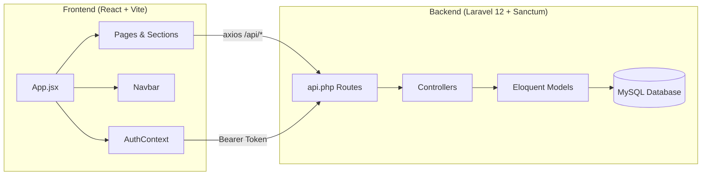

### Tech Stack

| Layer | Teknologi |
|---|---|
| Frontend | React 18, Vite, React Router, Axios, Lenis (smooth scroll), Lucide Icons |
| Backend | Laravel 12, Sanctum (token auth), Eloquent ORM |
| Database | MySQL |
| Auth | Bearer token via `localStorage` |

---

## 2. Data Model (ERD)

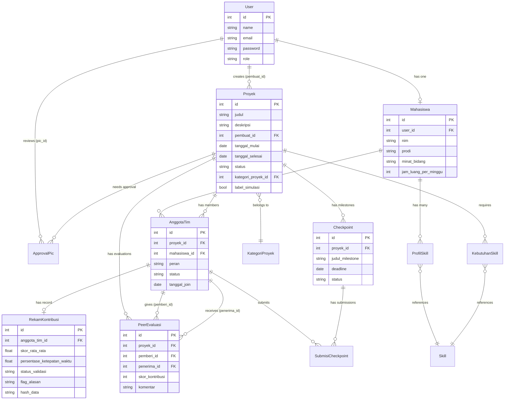

### User Roles

| Role | Hak Akses |
|---|---|
| `mahasiswa` | Register, login, edit profil/skill, cari tim, join proyek, submit checkpoint, peer evaluation |
| `pic_ukm` | Approve/reject proyek `waiting_approval`, validasi rekam kontribusi flagged |
| `dosen` | Approve/reject proyek, validasi rekam kontribusi flagged |
| `admin` | Semua hak akses |

### Status Flow — AnggotaTim (Keanggotaan)

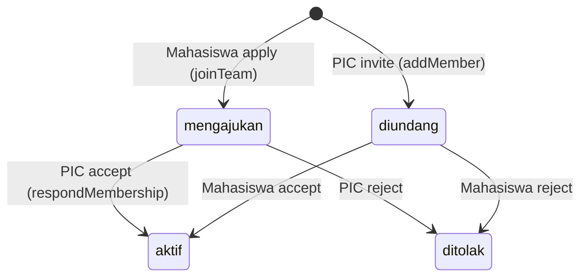

### Status Flow — Proyek

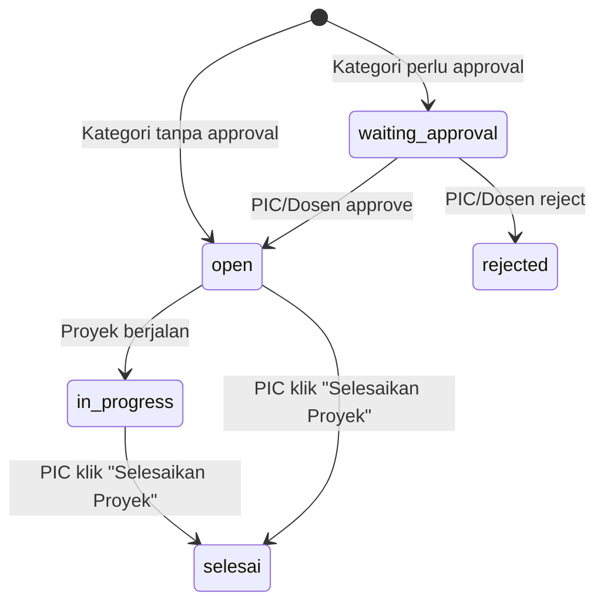

---

## 3. Frontend — Component Tree & Routing

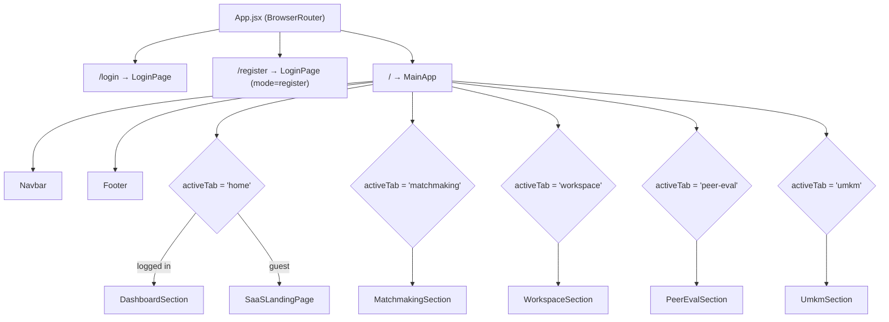

> [!IMPORTANT]
> Navigasi utama berbasis **tab state** (`activeTab`), bukan React Router paths. Semua halaman terproteksi ditampilkan secara conditional di dalam `MainApp`.

### Key Frontend Files

| File | Fungsi |
|---|---|
| [App.jsx](file:///var/www/html/fp/frontend/src/App.jsx) | Entry point, routing, tab state, user mapping, theme, Lenis |
| [AuthContext.jsx](file:///var/www/html/fp/frontend/src/contexts/AuthContext.jsx) | Login/register/logout/refreshUser, token management |
| [axios.js](file:///var/www/html/fp/frontend/src/api/axios.js) | Axios instance, auto-attach Bearer token, 401 redirect |
| [Navbar.jsx](file:///var/www/html/fp/frontend/src/components/Navbar.jsx) | Navigation, theme toggle, profile dropdown, availability modal |
| [DashboardSection.jsx](file:///var/www/html/fp/frontend/src/components/DashboardSection.jsx) | Dashboard: stats, created/joined projects, pending member requests |
| [MatchmakingSection.jsx](file:///var/www/html/fp/frontend/src/pages/MatchmakingSection.jsx) | JobStreet-style split layout, project browsing, quick-apply join |
| [WorkspaceSection.jsx](file:///var/www/html/fp/frontend/src/components/WorkspaceSection.jsx) | Sprint tracker, checkpoint CRUD, submission, validation, activity log |
| [PeerEvalSection.jsx](file:///var/www/html/fp/frontend/src/components/PeerEvalSection.jsx) | 360° peer eval sliders, SHA-256 portfolio card (mock data) |
| [UmkmSection.jsx](file:///var/www/html/fp/frontend/src/components/UmkmSection.jsx) | UMKM SDG-8 partnership, project listing, partner registration |
| [ProfileEditModal.jsx](file:///var/www/html/fp/frontend/src/components/ProfileEditModal.jsx) | Edit name, NIM, prodi, skills, availability |
| [CandidateDiscoveryModal.jsx](file:///var/www/html/fp/frontend/src/components/CandidateDiscoveryModal.jsx) | PIC-side: discover & invite candidates for project |
| [PeerEvaluationModal.jsx](file:///var/www/html/fp/frontend/src/components/PeerEvaluationModal.jsx) | Submit peer evaluation for completed projects |
| [AvailabilityModal.jsx](file:///var/www/html/fp/frontend/src/components/AvailabilityModal.jsx) | Weekly time schedule editor |

---

## 4. Backend — API Route Map

### Public Routes (no auth)

| Method | Endpoint | Controller | Deskripsi |
|---|---|---|---|
| `POST` | `/api/register` | AuthController@register | Registrasi user + mahasiswa |
| `POST` | `/api/login` | AuthController@login | Login, return Sanctum token |
| `GET` | `/api/proyek` | ProyekController@index | List semua proyek (open/in_progress/selesai) |
| `GET` | `/api/portfolio/{nim}` | RekamKontribusiController@getPublicPortfolio | Portfolio publik by NIM |
| `GET` | `/api/health` | Closure | Health check |

### Authenticated Routes (`auth:sanctum`)

#### Auth & Profile
| Method | Endpoint | Controller | Deskripsi |
|---|---|---|---|
| `POST` | `/api/logout` | AuthController@logout | Revoke token |
| `GET` | `/api/me` | AuthController@me | Get current user + mahasiswa + skills |
| `GET` | `/api/mahasiswa/profile` | MahasiswaController@profile | Detail mahasiswa profile |
| `PUT` | `/api/mahasiswa/profile` | MahasiswaController@updateProfile | Update name, NIM, prodi, jam_luang |
| `GET` | `/api/mahasiswa/skills` | MahasiswaController@getSkills | List profil skills user |
| `POST` | `/api/mahasiswa/skills` | MahasiswaController@addOrUpdateSkill | Add/update skill + level |
| `DELETE` | `/api/mahasiswa/skills/{id}` | MahasiswaController@removeSkill | Remove profil skill |
| `GET` | `/api/skills/master` | MahasiswaController@masterSkills | Master list all skills |

#### Proyek & Approval
| Method | Endpoint | Controller | Deskripsi |
|---|---|---|---|
| `POST` | `/api/proyek` | ProyekController@store | Create proyek + skills + checkpoints |
| `GET` | `/api/proyek/{id}` | ProyekController@show | Detail proyek + members + checkpoints |
| `PUT` | `/api/proyek/{id}` | ProyekController@update | Update proyek (owner only) |
| `DELETE` | `/api/proyek/{id}` | ProyekController@destroy | Delete proyek (owner only) |
| `GET` | `/api/proyek/categories` | ProyekController@getCategories | List kategori proyek |
| `GET` | `/api/proyek/waiting-approval` | ProyekController@getWaitingApproval | List proyek pending approval (dosen/pic) |
| `POST` | `/api/proyek/{id}/decide-approval` | ProyekController@decideApproval | Approve/reject (dosen/pic) |

#### Matchmaking & Team
| Method | Endpoint | Controller | Deskripsi |
|---|---|---|---|
| `GET` | `/api/proyek/{id}/candidates` | MatchmakingController@getCandidates | Ranked candidate list (skill_score 80% + minat 10% + onboarding 10%) |
| `POST` | `/api/proyek/{id}/join` | MatchmakingController@joinTeam | Mahasiswa apply → status `mengajukan` |
| `POST` | `/api/proyek/{id}/members` | MatchmakingController@addMember | PIC invite → status `diundang` |
| `DELETE` | `/api/proyek/{id}/members/{memberId}` | MatchmakingController@removeMember | Remove member (owner only) |
| `POST` | `/api/proyek/{id}/members/{memberId}/respond` | MatchmakingController@respondMembership | Accept/reject join request or invitation |

#### Checkpoints & Submissions
| Method | Endpoint | Controller | Deskripsi |
|---|---|---|---|
| `GET` | `/api/proyek/{proyekId}/checkpoints` | CheckpointController@getProjectCheckpoints | List checkpoints + user submission status |
| `POST` | `/api/proyek/{proyekId}/checkpoints` | CheckpointController@store | Create checkpoint (owner only) |
| `GET` | `/api/checkpoints/{id}` | CheckpointController@show | Detail checkpoint + all submissions |
| `PUT` | `/api/checkpoints/{id}` | CheckpointController@update | Update/validate checkpoint (owner) |
| `DELETE` | `/api/checkpoints/{id}` | CheckpointController@destroy | Delete checkpoint (owner) |
| `POST` | `/api/checkpoints/{checkpointId}/submit` | SubmisiCheckpointController@submitProgress | Submit progress + evidence link |
| `GET` | `/api/checkpoints/{checkpointId}/submissions` | SubmisiCheckpointController@getSubmissions | Get all submissions for checkpoint |

#### Peer Evaluation
| Method | Endpoint | Controller | Deskripsi |
|---|---|---|---|
| `GET` | `/api/proyek/{proyekId}/evaluasi` | PeerEvaluasiController@getProjectEvaluations | List all evaluations in project |
| `POST` | `/api/proyek/{proyekId}/evaluasi` | PeerEvaluasiController@submitEvaluation | Submit peer eval (hanya jika proyek `selesai`) |

#### Portfolio & Validation
| Method | Endpoint | Controller | Deskripsi |
|---|---|---|---|
| `GET` | `/api/portfolio` | RekamKontribusiController@getStudentPortfolio | My portfolio (student) |
| `GET` | `/api/reports/flagged` | RekamKontribusiController@getFlaggedReports | Flagged reports (dosen/pic) |
| `POST` | `/api/reports/{id}/validate` | RekamKontribusiController@validateReport | Validate flagged report (dosen/pic) |

---

## 5. Feature Workflows (End-to-End)

### 🔐 Workflow 1: Authentication

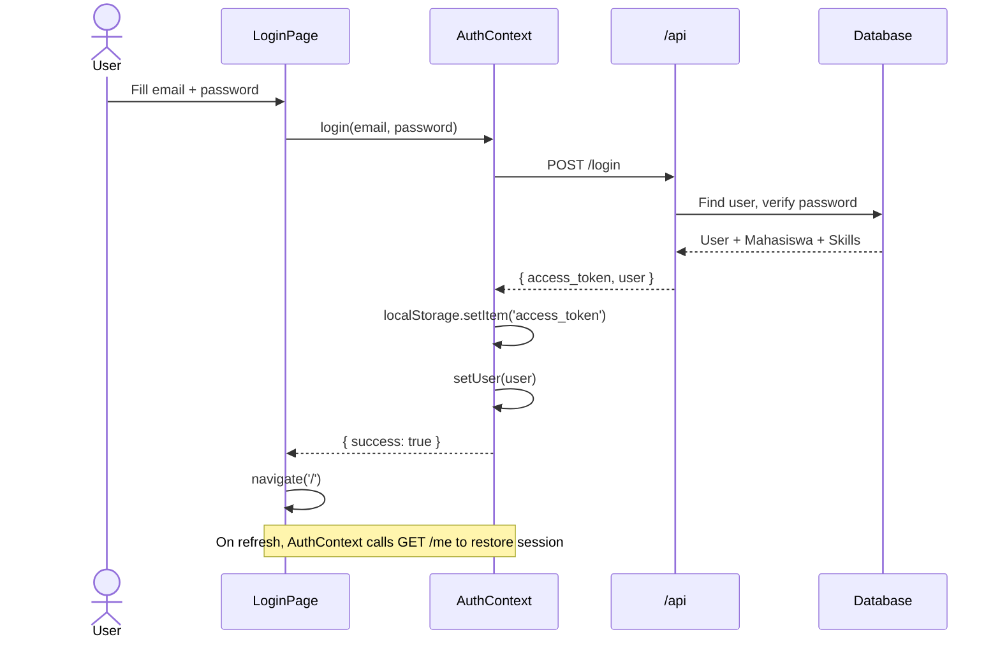

**Catatan**: Register flow identik, POST `/register` akan membuat User + Mahasiswa sekaligus.

---

### 📊 Workflow 2: Dashboard (Home — Logged In)

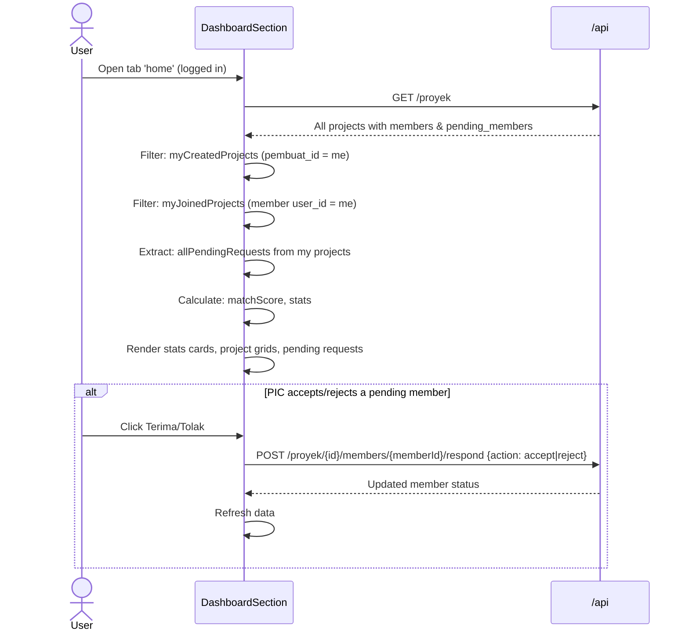

---

### 🔍 Workflow 3: Matchmaking & Team Finding

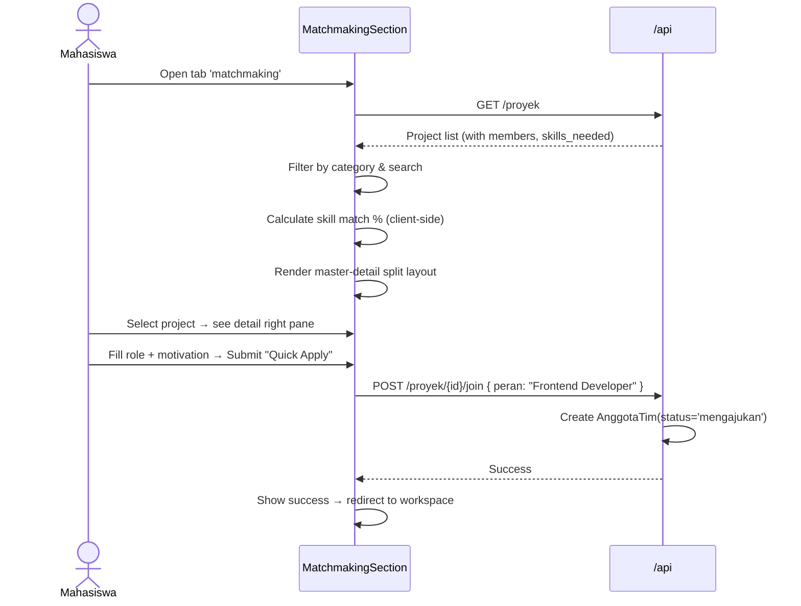

**Skor Matchmaking Backend (Candidate Discovery)**:
```
skor_akhir = (skill_score × 0.80) + (minat_bonus × 0.10) + (onboarding_bonus × 0.10)
```
- `skill_score` = rata-rata (level_keahlian / 5.0) per skill yang cocok
- `minat_bonus` = 1.0 jika minat_bidang match kategori proyek
- `onboarding_bonus` = 1.0 jika belum punya proyek aktif

---

### 🛠️ Workflow 4: Workspace & Sprint Checkpoints

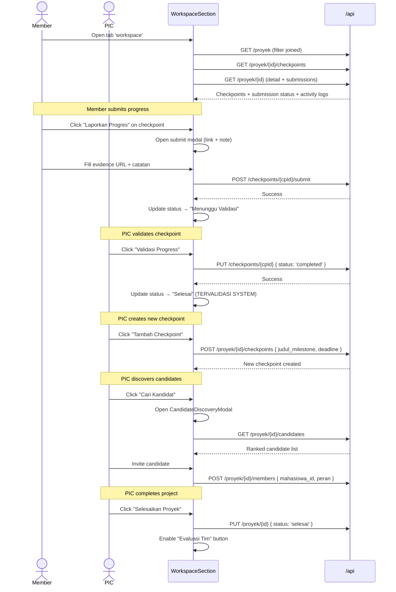

---

### ⭐ Workflow 5: Peer Evaluation & Anti Free-Rider

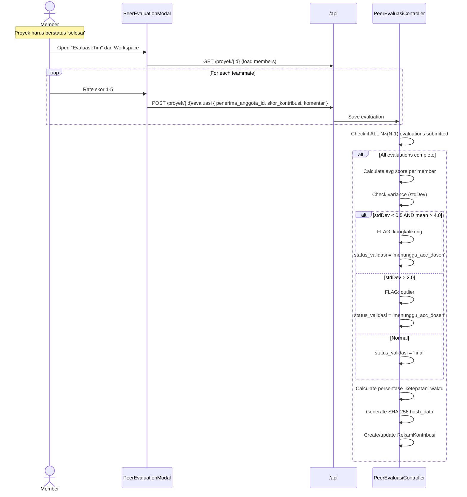

**Anti Free-Rider Detection**:
- **Kongkalikong** (collusion): Semua member saling beri skor tinggi (stdDev < 0.5 AND mean > 4.0) → flagged untuk review dosen
- **Outlier**: Skor sangat bervariasi (stdDev > 2.0) → flagged untuk review dosen
- Dosen/PIC dapat mereview flagged reports via `POST /reports/{id}/validate`

---

### 🏪 Workflow 6: UMKM SDG-8 Partnership

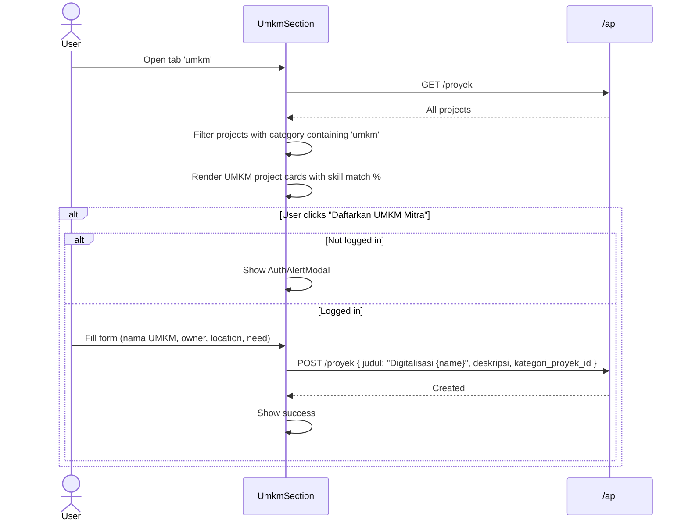

---

### 📜 Workflow 7: Portfolio & Contribution Records

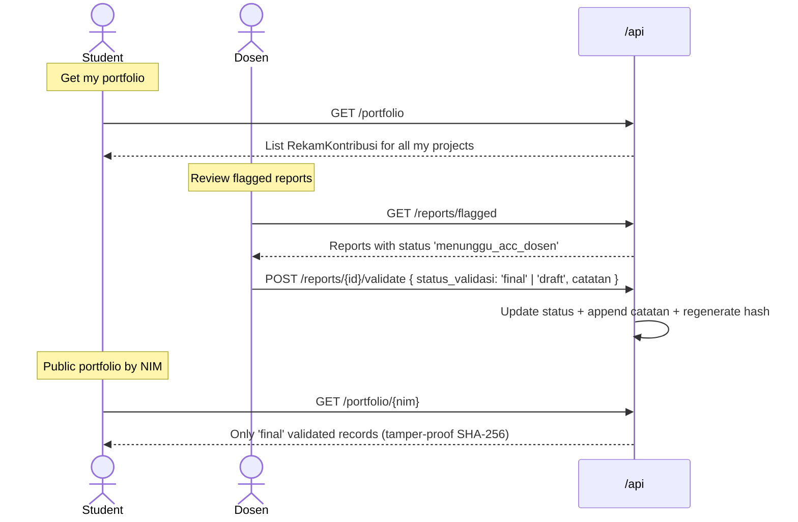

---

## 6. Ringkasan Key Business Rules

| Rule | Implementasi |
|---|---|
| Mahasiswa hanya bisa join jika proyek `open` | `MatchmakingController@joinTeam` cek `status === 'open'` |
| Peer eval hanya bisa setelah proyek `selesai` | `PeerEvaluasiController@submitEvaluation` cek `status === 'selesai'` |
| Tidak bisa evaluasi diri sendiri | `pemberi_id !== penerima_id` check |
| Proyek UMKM/Komunitas butuh approval dosen | `kategoriProyek.memerlukan_approval` → status `waiting_approval` |
| Free-rider detection otomatis | Variance analysis setelah semua N×(N-1) evaluasi masuk |
| Portofolio publik hanya tampil yang `final` | `getPublicPortfolio` filter `status_validasi === 'final'` |
| SHA-256 hash sebagai proof of record | Digenerate saat `RekamKontribusi` dibuat/diupdate |
| Project owner otomatis jadi "Project Leader" | `ProyekController@store` auto-create `AnggotaTim(status='aktif')` |
